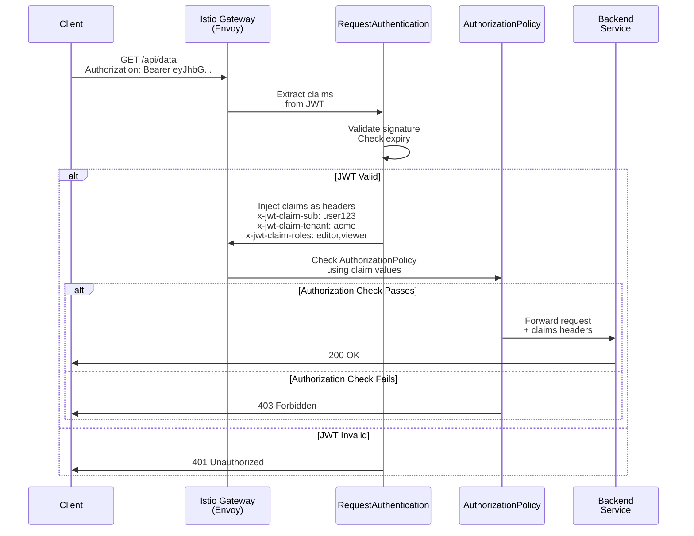

## The Problem: Beyond Role-Based Access Control

Role-based access control (RBAC) works fine when your authorization model is simple: "admins can do X, users can do Y". But real-world authorization is messier:

- Multi-tenant systems need to ensure users can only access their tenant's data
- APIs need to enforce audience claims (this token is only valid for *this* service)
- Fine-grained permissions (read, write, delete) change per user
- Custom business logic (users in department X can only access resources created on Mondays)

Istio's `AuthorizationPolicy` can handle role-based rules, but it requires hardcoding roles into policies. **Custom JWT claims** let your authorization decisions follow the token — no policy changes needed when permissions change.

---

## How Custom Claims Flow Through Istio

When a client makes a request with a JWT token:



The key insight: **JWT claims become request attributes** that AuthorizationPolicy can make decisions on. You don't need to hardcode permissions — they come from the token.

---

## Part 1: JWT Validation with RequestAuthentication

Before you can use claims for authorization, you need to extract and validate them from the JWT. This is the job of `RequestAuthentication`.

### Setup: Configure the OIDC Provider

```yaml
apiVersion: security.istio.io/v1beta1
kind: RequestAuthentication
metadata:
  name: jwt-auth
  namespace: istio-system
spec:
  selector:
    matchLabels:
      istio: ingressgateway
  jwtRules:
  - issuer: "https://accounts.example.com"
    jwksUri: "https://accounts.example.com/.well-known/jwks.json"
    audiences: "api.example.com"
    # Extract these specific claims and expose them as headers
    outputPayloadToHeader: "x-jwt-payload"
    forwardOriginalToken: true
    # Rules for different authentication flows
    rules:
    - methods: ["*"]
      principal: "*"
```

**What each field does:**

| Field | Purpose |
|-------|---------|
| `issuer` | The JWT issuer URL (must match the `iss` claim in tokens) |
| `jwksUri` | JWKS endpoint to fetch public keys for signature verification |
| `audiences` | Expected audience claim (`aud`). Tokens must contain this or they're rejected |
| `outputPayloadToHeader` | Istio will decode and base64-encode the JWT payload to this header |
| `forwardOriginalToken` | Keep the original `Authorization` header (useful for upstream services) |

### Testing JWT Validation

Generate a test JWT with custom claims:

```bash
# Create a test token (in practice, your OIDC provider does this)
TOKEN=$(curl -s -X POST https://accounts.example.com/token \
  -d 'client_id=test&client_secret=secret&grant_type=client_credentials&audience=api.example.com' \
  | jq -r '.access_token')

# Decode the token to see the claims
echo $TOKEN | jq -R 'split(".") | .[1] | @base64d | fromjson'
# Output:
# {
#   "iss": "https://accounts.example.com",
#   "sub": "user123",
#   "aud": "api.example.com",
#   "tenant_id": "acme",
#   "roles": ["editor", "viewer"],
#   "permissions": ["read", "write"],
#   "department": "engineering",
#   "exp": 1711632000,
#   "iat": 1711545600
# }

# Make a request through the gateway
curl -i -H "Authorization: Bearer $TOKEN" \
  https://api.example.com/api/data
```

If the JWT is valid, Istio injects the claims into the request as headers (via `outputPayloadToHeader` and as individual claim headers).

---

## Part 2: Authorization with Custom Claims

Once claims are extracted, `AuthorizationPolicy` can use them to make authorization decisions.

### Example 1: Tenant Isolation

Ensure users can only access their own tenant's data:

```yaml
apiVersion: security.istio.io/v1beta1
kind: AuthorizationPolicy
metadata:
  name: tenant-isolation
  namespace: istio-system
spec:
  selector:
    matchLabels:
      istio: ingressgateway
  action: ALLOW
  rules:
  - from:
    - source:
        principals: ["*"]
    to:
    - operation:
        paths: ["/api/tenants/*"]
    when:
    - key: request.headers[x-tenant-id]
      values:
    # Extract tenant_id from JWT and match against URL path
    # This rule allows if the tenant in the JWT matches the URL path
    - key: request.path
      notValues:
      - "/api/tenants/*/admin"  # Block admin endpoints
```

But wait — how do we extract the `tenant_id` claim from the JWT and match it against the request path?

**The challenge:** `AuthorizationPolicy` can match against headers, but it can't extract nested claims from the JWT payload. For complex claim logic, you need a different approach.

### Better Approach: Extract Claims as Headers

Configure Istio to automatically extract specific claims and inject them as headers:

```yaml
apiVersion: security.istio.io/v1beta1
kind: RequestAuthentication
metadata:
  name: jwt-auth-with-claims
  namespace: istio-system
spec:
  selector:
    matchLabels:
      istio: ingressgateway
  jwtRules:
  - issuer: "https://accounts.example.com"
    jwksUri: "https://accounts.example.com/.well-known/jwks.json"
    audiences: "api.example.com"
    # Use an EnvoyFilter to extract specific claims as headers
```

Actually, Istio doesn't directly extract nested claims to headers. For that, you need an **EnvoyFilter**:

```yaml
apiVersion: networking.istio.io/v1alpha3
kind: EnvoyFilter
metadata:
  name: jwt-claim-extraction
  namespace: istio-system
spec:
  workloadSelector:
    labels:
      istio: ingressgateway
  configPatches:
  - applyTo: HTTP_FILTER
    match:
      context: GATEWAY
      listener:
        filterChain:
          filter:
            name: envoy.filters.network.http_connection_manager
            subFilter:
              name: envoy.filters.http.jwt_authn
    patch:
      operation: INSERT_AFTER
      value:
        name: envoy.filters.http.lua
        typedConfig:
          "@type": type.googleapis.com/envoy.extensions.filters.http.lua.v3.Lua
          inline_code: |
            function envoy_on_response(response_handle)
              -- Extract tenant_id from x-jwt-payload header
              local jwt_payload = response_handle:headers():get("x-jwt-payload")
              if jwt_payload then
                local json = require("cjson")
                local decoded = json.decode(ngx.decode_base64(jwt_payload))
                if decoded.tenant_id then
                  response_handle:headers():add("x-tenant-id", decoded.tenant_id)
                end
                if decoded.roles then
                  response_handle:headers():add("x-roles", table.concat(decoded.roles, ","))
                end
              end
            end
```

Actually, Lua filters run on responses, not requests. For request-time header injection, use a **custom ext_authz service** or **WASM filter** (see our [ext_authz guide](/blog/istio-ext-authz-guide/) for details).

### Simpler Approach: Use AuthorizationPolicy with JWT Claims Directly

Istio 1.18+ supports matching JWT claims directly in AuthorizationPolicy. Here's how:

```yaml
apiVersion: security.istio.io/v1beta1
kind: AuthorizationPolicy
metadata:
  name: claim-based-authz
  namespace: istio-system
spec:
  selector:
    matchLabels:
      istio: ingressgateway
  action: ALLOW
  rules:
  # Allow users with "admin" role to access /admin paths
  - from:
    - source:
        principals: ["*"]
    to:
    - operation:
        paths: ["/admin/*"]
    when:
    - key: request.auth.claims[roles]
      values: ["admin"]

  # Allow users to access their tenant's data
  - from:
    - source:
        principals: ["*"]
    to:
    - operation:
        paths: ["/api/tenants/*"]
    when:
    - key: request.auth.claims[tenant_id]
      values: ["acme", "globex", "initech"]  # Whitelisted tenants

  # Allow read-only access with "viewer" role
  - from:
    - source:
        principals: ["*"]
    to:
    - operation:
        methods: ["GET", "HEAD"]
        paths: ["/*"]
    when:
    - key: request.auth.claims[roles]
      values: ["viewer"]
```

**Important:** `request.auth.claims[claim_name]` works only if the JWT was validated via `RequestAuthentication`. The claim values in the JWT must match the `values` list in the policy.

---

## Example: Multi-Tenant SaaS Gateway

Here's a real-world example for a SaaS platform:

### JWT Token Example

```json
{
  "iss": "https://auth.example.com",
  "sub": "user@acme.com",
  "aud": "api.example.com",
  "tenant_id": "acme",
  "org_id": "org_acme_123",
  "roles": ["editor", "viewer"],
  "permissions": ["read", "write", "delete"],
  "department": "engineering",
  "created_at": 1711545600,
  "exp": 1711632000
}
```

### RequestAuthentication

```yaml
apiVersion: security.istio.io/v1beta1
kind: RequestAuthentication
metadata:
  name: saas-jwt
  namespace: istio-system
spec:
  selector:
    matchLabels:
      istio: ingressgateway
  jwtRules:
  - issuer: "https://auth.example.com"
    jwksUri: "https://auth.example.com/.well-known/jwks.json"
    audiences: "api.example.com"
    outputPayloadToHeader: "x-jwt-payload"
    forwardOriginalToken: true
```

### AuthorizationPolicy

```yaml
apiVersion: security.istio.io/v1beta1
kind: AuthorizationPolicy
metadata:
  name: saas-authz
  namespace: istio-system
spec:
  selector:
    matchLabels:
      istio: ingressgateway
  action: ALLOW
  rules:
  # Public endpoints (no auth required)
  - to:
    - operation:
        paths:
        - "/health"
        - "/readyz"
        - "/signup"
        - "/login"

  # Tenant-specific endpoints: must have matching tenant_id
  - from:
    - source:
        principals: ["*"]
    to:
    - operation:
        paths: ["/api/tenants/*/"]
    when:
    - key: request.auth.claims[tenant_id]
      values: ["acme", "globex", "initech"]  # Whitelisted tenants

  # Admin panel: only for users with "admin" role
  - from:
    - source:
        principals: ["*"]
    to:
    - operation:
        paths: ["/admin/*"]
    when:
    - key: request.auth.claims[roles]
      values: ["admin"]

  # Engineering department only: /internal endpoints
  - from:
    - source:
        principals: ["*"]
    to:
    - operation:
        paths: ["/internal/*"]
    when:
    - key: request.auth.claims[department]
      values: ["engineering"]

  # Write operations require "editor" or "admin" role
  - from:
    - source:
        principals: ["*"]
    to:
    - operation:
        methods: ["POST", "PUT", "PATCH", "DELETE"]
        paths: ["/api/*"]
    when:
    - key: request.auth.claims[roles]
      values: ["editor", "admin"]

  # Read-only access with "viewer" role (anyone with this role can read)
  - from:
    - source:
        principals: ["*"]
    to:
    - operation:
        methods: ["GET", "HEAD"]
        paths: ["/api/*"]
    when:
    - key: request.auth.claims[roles]
      values: ["viewer", "editor", "admin"]
```

---

## Debugging Custom Claims Authorization

### 1. Verify JWT Validation

Check if the RequestAuthentication is validating tokens:

```bash
# Watch Envoy logs on the gateway
kubectl logs deploy/istio-ingressgateway -n istio-system -f | grep -i jwt

# Expected: "JWT verification succeeded" or "JWT validation failed"
```

### 2. Extract and Inspect the Payload Header

The `x-jwt-payload` header contains the base64-encoded JWT payload:

```bash
# Make a request and extract the payload header
PAYLOAD=$(curl -s -H "Authorization: Bearer $TOKEN" \
  https://api.example.com/api/data \
  -w "\n%{http_code}\n" | grep "^x-jwt-payload" | cut -d' ' -f2)

# Decode it
echo $PAYLOAD | base64 -d | jq .
```

### 3. Check AuthorizationPolicy Logs

```bash
# Set debug logging on the gateway
istioctl proxy-config log deploy/istio-ingressgateway \
  -n istio-system --level rbac:debug

# Watch logs for policy decisions
kubectl logs deploy/istio-ingressgateway -n istio-system -f | grep -i authz
```

### 4. Use `istioctl analyze` to Check Config

```bash
# Validate your AuthorizationPolicy syntax
istioctl analyze

# Output will flag any misconfigurations
# e.g., "AUTHZ_POLICY_NOT_ENFORCED: AuthorizationPolicy not found for workload"
```

### 5. Test with curl

```bash
# Without token
curl -i https://api.example.com/api/data
# Expected: 401 Unauthorized (RequestAuthentication required)

# With invalid token
curl -i -H "Authorization: Bearer invalid" \
  https://api.example.com/api/data
# Expected: 401 Unauthorized (JWT validation failed)

# With valid token but insufficient claims
TOKEN=$(create_jwt_with_claims '{"roles": ["viewer"]}')
curl -i -H "Authorization: Bearer $TOKEN" \
  -X POST https://api.example.com/api/data
# Expected: 403 Forbidden (AuthorizationPolicy denies)

# With valid token and correct claims
TOKEN=$(create_jwt_with_claims '{"roles": ["editor"]}')
curl -i -H "Authorization: Bearer $TOKEN" \
  -X POST https://api.example.com/api/data
# Expected: 200 OK (allowed)
```

---

## Advanced: Claim Arrays and String Matching

JWT claims can be arrays (like `roles: ["editor", "viewer"]`). AuthorizationPolicy checks if **any value in the claim array matches** any value in the policy's `values` list:

```yaml
# Token has:
# "roles": ["viewer", "editor"]

# Policy with:
when:
- key: request.auth.claims[roles]
  values: ["admin"]
# Result: DENY (no match)

# Policy with:
when:
- key: request.auth.claims[roles]
  values: ["editor"]  # "editor" is in the token's roles array
# Result: ALLOW
```

For string claims (like `tenant_id: "acme"`), the match is exact:

```yaml
# Token has:
# "tenant_id": "acme"

# Policy with:
when:
- key: request.auth.claims[tenant_id]
  values: ["acme", "globex"]
# Result: ALLOW (acme is in the list)

# Policy with:
when:
- key: request.auth.claims[tenant_id]
  values: ["other"]
# Result: DENY
```

---

## Best Practices

### 1. Always Validate Audience Claims

Ensure tokens are intended for your service:

```yaml
jwtRules:
- issuer: "https://auth.example.com"
  jwksUri: "..."
  audiences: "api.example.com"  # ← Critical
```

A token issued for service A shouldn't work on service B.

### 2. Extract Tenant ID from Token, Not URL

Don't trust tenant IDs from the request path:

```yaml
# ❌ WRONG: Trust the URL path
when:
- key: request.path
  values: ["/api/tenants/acme/"]

# ✅ CORRECT: Verify against the token claim
when:
- key: request.auth.claims[tenant_id]
  values: ["acme"]
```

The token is signed by your auth provider and can't be forged. The URL can be manipulated.

### 3. Use Deny-by-Default Rules

Start with explicit ALLOW rules for known paths, then deny everything else:

```yaml
spec:
  action: ALLOW  # Only these rules pass
  rules:
  - ... explicit allow rules ...

# Any request not matching above rules is denied
```

### 4. Rotate JWKS Regularly

```yaml
jwtRules:
- issuer: "https://auth.example.com"
  jwksUri: "https://auth.example.com/.well-known/jwks.json"
  # Istio caches the JWKS for 5 minutes by default
  # Set cache duration via env var:
  # PILOT_JWT_ENABLE_REMOTE_JWKS: "true"
  # PILOT_JWT_REMOTE_JWKS_TIMEOUT: 10s
```

### 5. Log Authorization Decisions

Add audit logging to track denials:

```bash
# Enable RBAC audit logging
kubectl set env deployment/istio-ingressgateway \
  -n istio-system \
  ENVOY_LOG_DEFAULT=info
```

---

## Limitations

### 1. Can't Extract Nested Claims Programmatically

AuthorizationPolicy can only match top-level claims. If your JWT has:

```json
{
  "user": {
    "department": "engineering"
  }
}
```

You can't match `request.auth.claims[user.department]`. You'd need a custom ext_authz service or WASM filter to handle nested claims.

### 2. No Negative Matching

You can list allowed values but not disallowed values:

```yaml
# ✅ Allowed
when:
- key: request.auth.claims[role]
  values: ["admin", "editor"]

# ❌ Not supported: deny if NOT admin
when:
- key: request.auth.claims[role]
  notValues: ["viewer"]
```

For negative matching, use a DENY-type AuthorizationPolicy.

### 3. Limited Claim Types

Istio can match:
- String claims (exact match)
- Array claims (any value matches)
- Boolean claims (can match "true" or "false")

Complex types (objects, numbers as ranges) require external logic.

---

## When to Use Custom Claims vs ext_authz

| Use Case | Custom Claims | ext_authz |
|----------|---------------|-----------|
| Simple role/tenant checks | ✅ Use this | Overkill |
| Complex business logic | ❌ Can't do | ✅ Use this |
| Database lookups | ❌ Can't do | ✅ Use this |
| Nested JWT claims | ❌ Can't do | ✅ Use this |
| Per-user rate limiting | ❌ Can't do | ✅ Use this |
| Static claim matching | ✅ Use this | Works, but slower |

---

## Conclusion

Custom JWT claims let you move authorization logic into the token. Instead of hardcoding RBAC rules, your permissions travel with the request. `RequestAuthentication` validates the token, and `AuthorizationPolicy` makes decisions based on claims.

For simple cases — role-based access, tenant isolation, audience restrictions — this is powerful and lightweight. For complex logic, fall back to an external [ext_authz service](/blog/istio-ext-authz-guide/).

---

*Related posts:*
- *[Building a Custom ext_authz Server for Istio](/blog/istio-ext-authz-guide/)*
- *[mTLS Debugging Guide](/blog/mtls-debugging-guide/)*
- *[Istio Observability: Golden Signals for Security Policies](/blog/istio-observability-control-plane/)*
