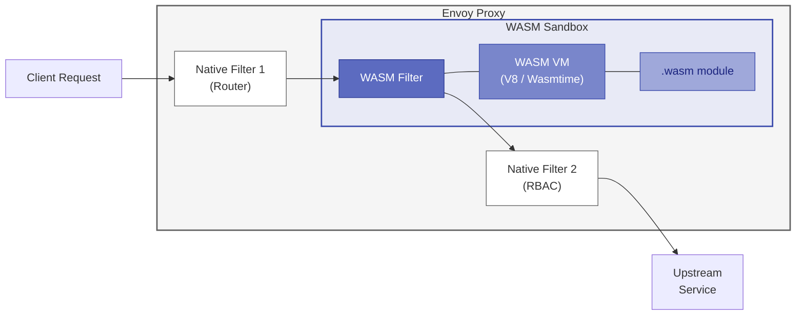
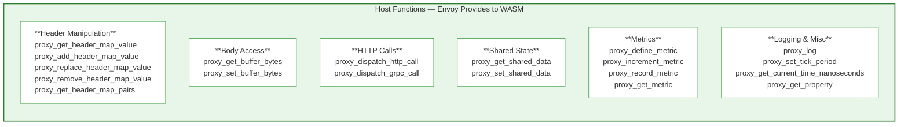
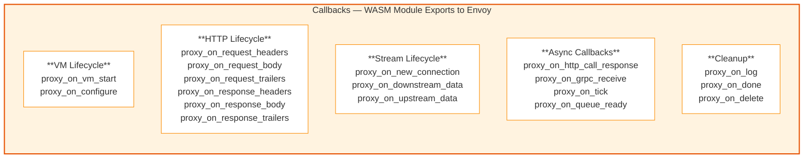
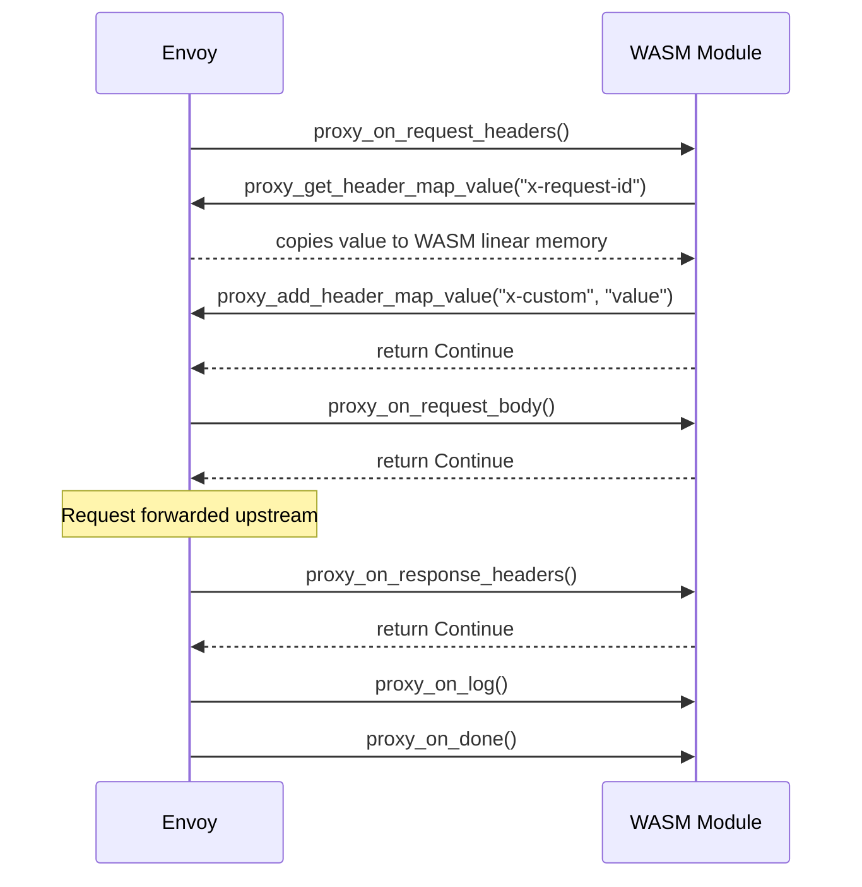
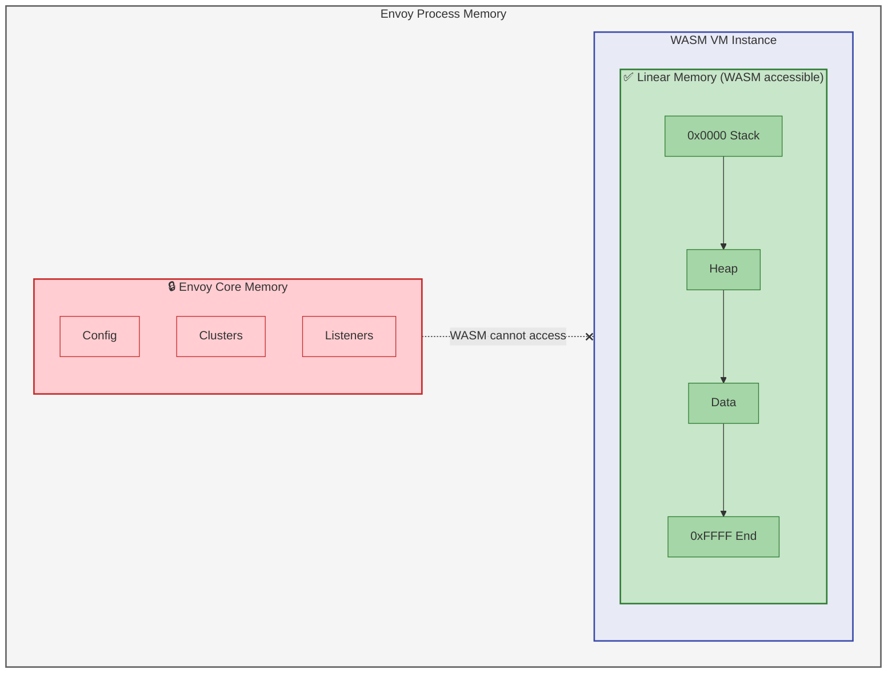
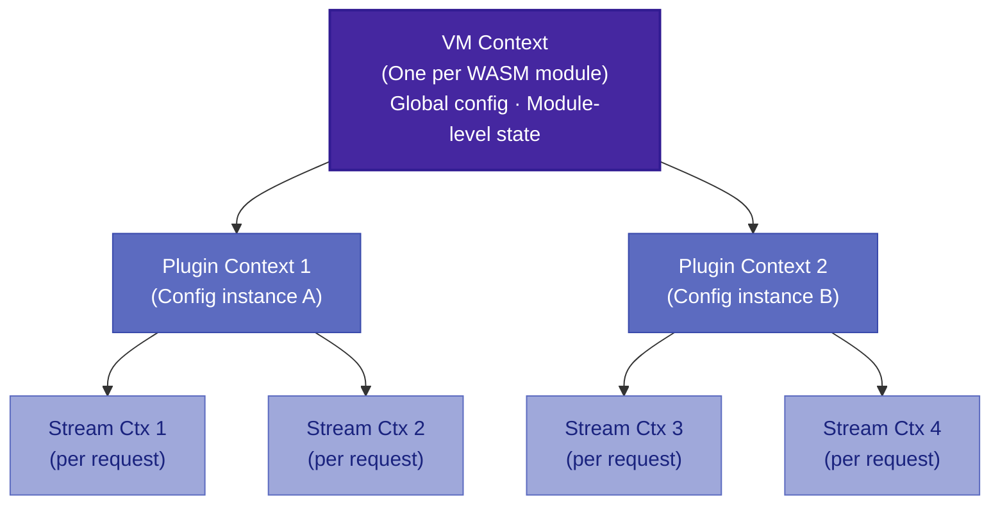
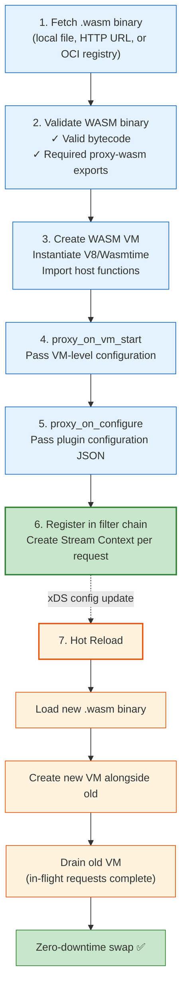

## The Problem WASM Solves in Envoy

Envoy is written in C++. Historically, if you wanted to add custom logic — a custom auth check, a header transformation, a proprietary rate limiter — you had two options:

1. **Fork Envoy** and write a native C++ filter. Compile the entire binary. Maintain your fork across every upstream release.
2. **Use Lua filters** — Envoy's embedded Lua scripting. Limited API surface, no type safety, poor debugging, and Lua's single-threaded runtime becomes a bottleneck.

Neither option scales for organizations running Envoy at the edge and as a sidecar in service mesh. Teams need a way to safely extend Envoy **without rebuilding it** and **without compromising stability**.

WebAssembly solves this by providing a sandboxed, portable execution environment that runs inside Envoy's process. You write your filter in Rust, Go, C++, or AssemblyScript, compile it to a `.wasm` binary, and Envoy loads it at runtime.

But how does this actually work under the hood?

---

## Architecture: Where WASM Sits Inside Envoy

When Envoy processes a request, it passes through a **filter chain** — an ordered list of filters that each get a chance to inspect, modify, or reject the request and response.



A WASM filter sits in the same filter chain as native C++ filters. From Envoy's perspective, it's just another filter. The difference is that the WASM filter's logic runs inside a **virtual machine** (V8 or Wasmtime) that enforces strict isolation.

Key architectural properties:

- The WASM module runs **in-process** with Envoy — no IPC, no network hops
- Each worker thread gets its **own WASM VM instance** — no cross-thread contention
- The WASM module has **zero direct access** to Envoy's memory, file system, or network
- All interaction between the WASM module and Envoy happens through a strictly defined ABI

---

## The proxy-wasm ABI: The Contract Between WASM and Envoy

The most important concept to understand is the **proxy-wasm ABI** (Application Binary Interface). This is the formal contract that defines how a WASM module communicates with the host proxy (Envoy).

### Who Controls the ABI?

The proxy-wasm ABI is defined in the [proxy-wasm/spec](https://github.com/proxy-wasm/spec) repository. It is a **community-driven specification** originally initiated by Google and now maintained by the proxy-wasm community. The spec is **not owned by Envoy or Istio** — it's designed to be proxy-agnostic. In theory, any proxy that implements the host side of the ABI can run proxy-wasm modules (MOSN and OpenResty also have implementations).

The spec defines two sides of the interface:

### Host Functions (Proxy → WASM)

These are functions that **Envoy exposes** to the WASM module. The WASM module calls these to interact with the outside world:



When your WASM filter wants to read a request header, it doesn't access Envoy's memory directly. Instead, it calls `proxy_get_header_map_value`, and Envoy copies the header value into the WASM module's linear memory.

### Callbacks (WASM → Proxy)

These are functions that the **WASM module exports** for Envoy to call at specific lifecycle points:



When a request arrives, Envoy calls `proxy_on_request_headers` on your WASM module. Your filter processes the headers and returns an action (`Continue`, `Pause`, or `StopIteration`) to tell Envoy what to do next.

### How a Request Flows Through a WASM Filter

Here's the actual sequence of calls for a single HTTP request:



Every data exchange goes through copy operations. The WASM module never directly reads Envoy's internal data structures.

---

## The Sandbox: How WASM Isolation Works

WASM in Envoy provides a true sandbox. This isn't just "we made it hard to escape" — the isolation is enforced by the WASM specification itself at the instruction level.

### Linear Memory Model

Each WASM module gets a **linear memory** — a contiguous byte array that starts at 0 and grows upward. This is the only memory the WASM module can access.



The WASM instruction set enforces this boundary. Every memory access in WASM is a relative offset within the linear memory. There is no instruction in WASM that lets you compute an arbitrary pointer to host memory. The runtime (V8 or Wasmtime) performs bounds checking on every memory access.

### What the Sandbox Prevents

| Threat | Prevention |
|--------|-----------|
| Buffer overflow into host | Linear memory bounds checking — every access is validated |
| Arbitrary syscalls | WASM has no syscall instructions — only host-imported functions |
| File system access | No filesystem ABI exposed by proxy-wasm |
| Network access | Only via `proxy_dispatch_http_call` — Envoy controls the connection |
| Reading other WASM modules' memory | Each VM instance has its own isolated linear memory |
| Infinite loops | `proxy_set_tick_period` and runtime timeouts can detect stuck modules |
| Stack overflow | WASM has a fixed, bounded call stack enforced by the runtime |

### What the Sandbox Does NOT Prevent

- **CPU exhaustion** — A WASM module can consume CPU cycles within its execution. Envoy does not enforce per-module CPU quotas.
- **Memory growth** — The WASM module can request more linear memory (up to the configured limit). If the limit is too high, it can pressure the host process.
- **Slow responses** — A filter that calls `proxy_dispatch_http_call` and doesn't handle timeouts can stall the request.

---

## WASM Runtimes: V8 vs Wasmtime vs wamr

Envoy supports multiple WASM runtimes. The runtime is the engine that actually compiles and executes the `.wasm` binary.

### V8 (Default)

V8 is Google's JavaScript and WebAssembly engine — the same engine that powers Chrome and Node.js. It's the **default runtime in Envoy** and in Istio's sidecar proxy.

```
envoy.wasm.runtime.v8
```

- **Compilation strategy**: JIT (Just-In-Time) by default, can also AOT compile
- **Maturity**: Extremely battle-tested — runs billions of WASM modules in Chrome
- **Performance**: Excellent — V8's optimizing compiler (TurboFan) produces highly optimized native code
- **Binary size impact**: V8 adds ~20MB to the Envoy binary
- **Limitations**: Higher startup time due to JIT compilation of the WASM module

### Wasmtime

Wasmtime is Mozilla's standalone WASM runtime, built on the Cranelift compiler backend.

```
envoy.wasm.runtime.wasmtime
```

- **Compilation strategy**: AOT-focused, with strong Cranelift codegen
- **Maturity**: Production-ready, used by Fastly and others
- **Performance**: Comparable to V8 for most workloads
- **Binary size impact**: Smaller than V8
- **Advantage**: Better suited for AOT compilation workflows

### wamr (WebAssembly Micro Runtime)

```
envoy.wasm.runtime.wamr
```

- **Target**: Resource-constrained environments
- **Compilation strategy**: Interpreter mode or AOT
- **Performance**: Slower than V8/Wasmtime in JIT mode but very lightweight
- **Use case**: Edge/IoT deployments where memory is tight

### Null Runtime (for testing)

```
envoy.wasm.runtime.null
```

This compiles your WASM filter as native C++ code linked directly into Envoy. It's used for **development and testing only** — it gives you native performance with the proxy-wasm programming model, but without any sandboxing.

---

## The Context Hierarchy: VM, Plugin, and Stream

WASM in Envoy uses a three-level context hierarchy that controls how state is shared and isolated:



- **VM Context**: Created once when the WASM module is loaded. Use it for one-time initialization.
- **Plugin Context**: Created for each unique configuration instance. If you apply the same WASM module to multiple listeners with different configs, each gets its own Plugin Context.
- **Stream Context (HTTP or TCP)**: Created for **every request/connection**. This is where your per-request logic lives. It is destroyed when the request completes.

In your SDK code (Go example), these map to:

```go
type vmContext struct{}      // → VM Context: proxy_on_vm_start
type pluginContext struct{}  // → Plugin Context: proxy_on_configure
type httpContext struct{}    // → Stream Context: proxy_on_request_headers, etc.
```

Understanding this hierarchy matters because it controls memory lifetime and state sharing. A common mistake is storing per-request state in the Plugin Context, which persists across requests and leads to memory leaks or stale data.

---

## How Envoy Loads a WASM Module

When Envoy starts or when a new WASM configuration is pushed via xDS, it goes through this sequence:



The last point is crucial — Envoy can **hot-reload** WASM modules without restarting. This is one of the primary advantages over native C++ filters.

---

## Shared Data and Cross-Filter Communication

WASM modules are isolated by default, but the proxy-wasm ABI provides controlled mechanisms for sharing state:

### Shared Key-Value Store

```go
// Writer filter
err := proxywasm.SetSharedData("rate_limit_count", []byte("42"), 0)

// Reader filter (can be a different WASM module)
value, cas, err := proxywasm.GetSharedData("rate_limit_count")
```

The shared KV store uses **compare-and-swap (CAS)** for thread safety. Each value has a CAS token — if the value was modified since you last read it, your write will fail, and you must retry.

**Important limitation**: The shared KV store is **per-VM, not per-cluster**. If you have 10 Envoy instances, each has its own independent KV store. There is no built-in distributed state mechanism.

### Shared Queues

```go
// Register a queue
queueID, err := proxywasm.RegisterSharedQueue("my_queue")

// Enqueue data
err = proxywasm.EnqueueSharedQueue(queueID, []byte("message"))

// Dequeue (in proxy_on_queue_ready callback)
data, err := proxywasm.DequeueSharedQueue(queueID)
```

Shared queues enable producer-consumer patterns between filters within the same Envoy instance.

---

## Advantages of WASM Filters

### 1. No Envoy Fork Required

This is the headline advantage. Maintaining a custom Envoy fork is operationally expensive — you need to track upstream releases, resolve merge conflicts in C++ code, maintain CI/CD pipelines for the custom binary, and manage the distribution of custom builds. WASM eliminates all of this.

### 2. Language Flexibility

You're not limited to C++. The proxy-wasm ecosystem supports:

| Language | SDK | Maturity |
|----------|-----|----------|
| Rust | proxy-wasm-rust-sdk | Production-ready, best performance |
| Go | proxy-wasm-go-sdk (via TinyGo) | Production-ready, easiest to learn |
| C++ | proxy-wasm-cpp-sdk | Production-ready |
| AssemblyScript | proxy-wasm-assemblyscript-sdk | Experimental |

### 3. Hot-Reloadable

Push a new `.wasm` binary via xDS, and Envoy loads it without restart. In-flight requests drain on the old filter, new requests use the new filter. This enables canary deployments of filter logic.

### 4. Safety Through Isolation

A bug in a native C++ filter can segfault Envoy, crash the process, and take down every connection on that proxy. A bug in a WASM filter is contained within the sandbox. The worst case is that the filter produces incorrect results or runs out of memory — Envoy itself keeps running.

### 5. Portable Across Proxies

Because proxy-wasm is a specification (not an Envoy feature), your WASM module can theoretically run on any proxy that implements the spec. This includes Envoy, MOSN, and experimental implementations in other proxies.

### 6. Distribution via OCI Registries

WASM binaries can be stored in OCI-compatible registries (Docker Hub, GHCR, ECR). Istio's `WasmPlugin` CRD pulls from these registries, making WASM filters first-class artifacts in your container workflow.

---

## Disadvantages of WASM Filters

### 1. Performance Overhead

Every interaction between the WASM module and Envoy involves a **context switch** across the sandbox boundary and **memory copies**. Reading a header requires:
1. WASM calls `proxy_get_header_map_value`
2. Envoy looks up the header value
3. Envoy copies the value into WASM linear memory
4. Control returns to WASM

For a native C++ filter, this is a direct pointer dereference. The overhead per host function call is small (~100-500ns), but it adds up in filters that make many ABI calls per request. See our [benchmark post](/blog/native-vs-wasm-filter-benchmark/) for concrete numbers.

### 2. Limited API Surface

The proxy-wasm ABI exposes a subset of Envoy's capabilities. You **cannot**:
- Access the cluster manager directly
- Modify listener configurations
- Interact with Envoy's admin interface
- Use Envoy's built-in circuit breaker or outlier detection APIs
- Access connection-level TLS details beyond what `proxy_get_property` exposes

If you need capabilities outside the ABI, you're stuck.

### 3. Debugging is Painful

WASM debugging tools are immature compared to native C++ debugging:
- No `gdb` / `lldb` attach to WASM modules running inside Envoy
- Stack traces from WASM panics are often opaque (numeric function indices, not symbol names)
- Logging via `proxy_log` is your primary debugging tool
- The TinyGo compiler (used for Go SDK) has its own quirks and incompatibilities with standard Go libraries

### 4. TinyGo Limitations (for Go SDK)

If you're using the Go SDK, you're compiling with TinyGo, not the standard Go compiler. TinyGo doesn't support the full Go standard library:

- No `net/http` — you can't make HTTP calls with Go's standard client
- No `encoding/json` with reflection — use `gjson` or manual parsing
- No goroutines with full concurrency support
- Limited `fmt` package
- No `os` or `io/ioutil`

These limitations catch many Go developers by surprise.

### 5. Memory Overhead

Each WASM VM instance consumes memory for the runtime itself (~2-4MB) plus the module's linear memory. In a service mesh with hundreds of sidecars, each running multiple WASM filters, this adds up:

```
Memory per sidecar = (VM runtime memory + linear memory) × number of filters × workers
Example: (3MB + 1MB) × 2 filters × 4 workers = 32MB additional memory per sidecar
```

### 6. No Direct Network Access

WASM modules cannot open sockets. All external communication must go through:
- `proxy_dispatch_http_call` — async HTTP call managed by Envoy
- `proxy_dispatch_grpc_call` — async gRPC call managed by Envoy

This means you can't use your language's native HTTP client libraries, database drivers, or message queue clients.

---

## Limitations of the Current WASM Implementation

Beyond the architectural advantages and disadvantages, there are specific limitations in today's proxy-wasm and Envoy WASM implementation that you should be aware of:

### 1. ABI Version Fragmentation

The proxy-wasm ABI has gone through multiple versions (0.1.0, 0.2.0, 0.2.1). SDKs target specific ABI versions, and Envoy versions support specific ABI versions. Mixing incompatible versions results in silent failures or crashes:

```
SDK compiled for ABI 0.2.1  +  Envoy supporting ABI 0.2.0  =  💥
```

There is no graceful version negotiation — you need to ensure your SDK, compilation target, and Envoy version all align. The Istio `WasmPlugin` CRD does not validate ABI compatibility at apply time.

### 2. No Streaming Body Processing

While the ABI has `proxy_on_request_body` and `proxy_on_response_body`, the current implementation in most SDKs **buffers the entire body** before invoking your callback. True streaming (processing body chunks as they arrive without buffering) is possible but tricky — you need to return `StopIterationAndBuffer` or `StopIterationAndWatermark` and handle chunk reassembly yourself.

For large payloads (file uploads, video streams), this buffering can consume significant memory in the WASM linear memory space.

### 3. Limited Observability of WASM Itself

Envoy exposes some WASM-related stats:
- `wasm.envoy_wasm_runtime_*` — runtime-level metrics
- `wasm.*` — custom metrics defined by your filter

But there's no built-in profiling of WASM execution. You can't easily answer:
- How much CPU time did my WASM filter consume per request?
- What's the memory high-water mark of my module?
- Which host function calls are the bottleneck?

You end up building your own instrumentation using `proxy_get_current_time_nanoseconds` around critical sections.

### 4. No Cross-VM State

As mentioned earlier, the shared KV store is local to a single Envoy instance. There is no proxy-wasm mechanism for sharing state across Envoy instances. If your filter needs distributed state (e.g., global rate limiting counters), you must call an external service via `proxy_dispatch_http_call`.

### 5. Cold Start Latency

When a WASM module is loaded for the first time (or after a config update), the WASM runtime must:
1. Parse and validate the bytecode
2. JIT-compile (V8) or AOT-load (Wasmtime) the native code
3. Instantiate the module and call `proxy_on_vm_start`

For a typical 200-500KB WASM module on V8, this takes **10-50ms**. During this time, requests may see increased latency or be queued. In high-churn environments (frequent config updates), this cold start adds up.

### 6. Thread Model Constraints

Envoy runs multiple worker threads. Each worker gets its own WASM VM instance. This means:
- State in your filter is **per-worker** by default
- The shared KV store is the only cross-worker communication mechanism
- You cannot use language-level concurrency (Go goroutines, Rust async) — the WASM execution is single-threaded within each worker

### 7. WASI Support is Partial

WASI (WebAssembly System Interface) is the standard for WASM modules to interact with system resources. Envoy's WASM implementation only supports a **subset** of WASI:
- Basic clock functions (`clock_time_get`)
- Random number generation (`random_get`)
- Environment variables (limited)

File I/O, socket access, and process management WASI APIs are **not supported**. Don't expect your WASM module to read files or open connections through WASI.

### 8. Maximum Module Size

While not a hard spec limit, practical constraints exist. V8 has compile-time limits on module complexity and Envoy imposes configurable memory limits. Very large WASM binaries (>10MB) can hit compilation timeouts or OOM during instantiation. Keep your WASM modules focused and lean.

---

## When to Use WASM vs Alternatives

| Use Case | Best Approach |
|----------|--------------|
| Simple header manipulation | WASM filter — fast to build, safe to deploy |
| Custom auth with external callout | WASM or `ext_authz` — WASM if logic is simple, ext_authz for complex auth |
| Heavy payload transformation | `ext_proc` — avoids WASM memory limits |
| Global rate limiting | External service via `ext_authz` or gRPC callout — WASM can't do distributed state |
| Latency-critical path (<1ms budget) | Native C++ filter — eliminates sandbox overhead |
| Team doesn't know C++ | WASM (Rust or Go SDK) |
| Need to update filter logic frequently | WASM — hot-reload without proxy restart |
| Complex business logic with many dependencies | `ext_proc` or sidecar service — avoid TinyGo/WASM library limitations |

---

## Practical Example: Understanding the ABI in Action

To make the ABI concrete, here's what happens at the binary level when your Go WASM filter reads a header:

```go
// Your Go code
value, err := proxywasm.GetHttpRequestHeader("x-request-id")
```

This compiles to WASM bytecode that:

1. Writes the string `"x-request-id"` into linear memory at some offset (say, `0x1000`)
2. Calls the imported host function:
   ```wasm
   call $proxy_get_header_map_value
     (i32.const 0)           ;; header map type: request headers
     (i32.const 0x1000)      ;; pointer to key in linear memory
     (i32.const 12)          ;; key length ("x-request-id" = 12 chars)
     (i32.const 0x2000)      ;; pointer where Envoy should write the value pointer
     (i32.const 0x2004)      ;; pointer where Envoy should write the value length
   ```
3. Envoy's implementation:
   - Reads the key from WASM linear memory at offset `0x1000`, length 12
   - Looks up `"x-request-id"` in the request's header map
   - Allocates space in WASM linear memory for the value (by calling the WASM module's `malloc`)
   - Copies the header value into that allocated space
   - Writes the pointer and length to `0x2000` and `0x2004`
4. Control returns to WASM, which reads the value from the pointer stored at `0x2000`

This copy-based interaction is why WASM filters are slower than native filters for header-heavy operations — but it's also why they're safe.

---

## Conclusion

WASM in Envoy is not magic — it's a well-defined sandbox built on a strict ABI contract. The proxy-wasm specification provides the interface, V8 or Wasmtime provides the execution engine, and WASM's linear memory model provides the isolation.

For most teams extending Envoy in a service mesh, WASM is the right choice. The performance overhead is real but manageable (see our [benchmark](/blog/native-vs-wasm-filter-benchmark/)), and the operational benefits — no fork maintenance, hot-reload, language choice, safety — outweigh the cost for all but the most latency-sensitive paths.

The key is understanding the limitations: the ABI boundary is both your safety net and your constraint. Design your filters to minimize host function calls, keep your module lean, and reach for `ext_proc` or external services when you need capabilities beyond what the sandbox provides.

---

*Related posts:*
- *[Native C++ vs WASM Filters: A Performance Benchmark](/blog/native-vs-wasm-filter-benchmark/)*
- *[Building Envoy WASM Filters: From Hello World to Production](/blog/envoy-wasm-extensions/)*
