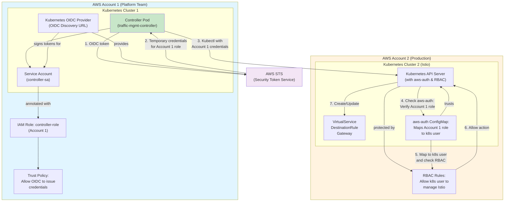

## The Challenge: Managing Istio Across AWS Accounts

Imagine you're running Kubernetes clusters in multiple AWS accounts. Your architecture looks something like this:

- **Account 1**: Your platform team's central Kubernetes cluster running a custom controller
- **Account 2**: Your production workload cluster running Istio service mesh and actual applications

Your controller (in Account 1) needs to create and manage Istio resources (VirtualServices, DestinationRules, Gateways) in the production cluster (Account 2). The challenge: **How do you let a pod in one AWS account safely access and modify Kubernetes resources in a different AWS account?**

### The Wrong Way (And Why It Fails)

Without proper security, teams often resort to:
- **Hardcoding AWS credentials** in the controller deployment (massive security risk!)
- **Long-lived IAM access keys** in Kubernetes secrets (exposed in etcd!)
- **Overly permissive IAM policies** allowing any action from any resource (violates least privilege)
- **No audit trail** of who accessed what (compliance nightmare)

All of these are security disasters waiting to happen.

### The Right Way: IRSA + Direct aws-auth Mapping

**IRSA** is AWS's secure mechanism for associating IAM roles with Kubernetes service accounts. The elegant part: your pod's IAM role (Account 1) can be **directly mapped** to a Kubernetes user in Account 2 via the `aws-auth` ConfigMap. No cross-account role assumption needed.

Think of it like a trusted introduction:
1. Your pod's service account is registered with AWS IAM (Account 1)
2. AWS verifies the pod's identity using Kubernetes' OIDC provider
3. The pod receives temporary credentials automatically
4. The pod uses those credentials to connect to Account 2's Kubernetes API
5. Account 2's `aws-auth` ConfigMap recognizes the Account 1 role and maps it to a Kubernetes user
6. RBAC controls what that user can do
7. All access is audited in CloudTrail

This guide walks you through the complete setup.

---

## What is IRSA? (The Concepts)

### Kubernetes Service Accounts Meet AWS IAM

**Kubernetes Service Accounts** are how pods authenticate within a cluster. They're like "pod identities" that allow the Kubernetes API to know which pod is making a request.

**IRSA** connects this Kubernetes identity to AWS IAM roles. Here's how:

```
Kubernetes Service Account
        ↓ (has annotation)
Kubernetes OIDC Provider (trusts AWS)
        ↓ (generates OIDC token)
AWS STS (Security Token Service)
        ↓ (verifies token authenticity)
AWS IAM Role (with trust policy)
        ↓ (assumable by this pod)
Temporary AWS Credentials
```

### Why IRSA is Superior

| Aspect | Static Credentials | IRSA |
|--------|-------------------|------|
| **Credential Storage** | Secrets in etcd (vulnerable to breach) | Generated on-demand (never stored) |
| **Credential Rotation** | Manual (usually never happens) | Automatic (hourly by default) |
| **Credential Scope** | Can do anything the key allows | Limited by IAM role policies |
| **Audit Trail** | Manual logging (if configured) | Automatic CloudTrail entries |
| **Operational Overhead** | High (key rotation, secret management) | Low (handled by AWS/Kubernetes) |

### The OIDC Provider (Non-Technical Explanation)

Your Kubernetes cluster runs an **OIDC Provider** — think of it as a trusted identity verification system. When a pod needs AWS credentials:

1. The pod asks Kubernetes: "Who am I?"
2. Kubernetes issues a cryptographically signed token saying "This is pod X in service account Y"
3. The pod presents this token to AWS
4. AWS checks: "Is this token signed by a Kubernetes cluster I trust?" (verified via OIDC)
5. If yes, AWS grants temporary credentials

No passwords or keys needed. Just cryptographic proof of identity.

---

## Architecture Overview: The Complete Picture

Let me show you exactly what's deployed where:



### What Each Component Does

**Account 1 (Platform Team's Cluster)**
- **Controller Pod**: Your application (e.g., traffic management controller) that needs to manage Istio
- **Service Account**: Kubernetes identity for the controller pod
- **OIDC Provider**: Kubernetes' built-in provider that signs identity tokens
- **IAM Role A**: Created in Account 1, trusts the OIDC provider to issue credentials
- **Trust Policy**: Specifies "the OIDC provider can issue credentials for this role"

**Account 2 (Production Cluster)**
- **Istio Resources**: VirtualServices, DestinationRules, Gateways you want to manage
- **aws-auth ConfigMap**: Maps the Account 1 IAM role to a Kubernetes user/group
- **RBAC Rules**: Control what the cross-account user can do in the cluster
- **API Server**: Kubernetes API protected by aws-auth integration and RBAC

**The Security Model** (Defense in Depth)
1. **OIDC Verification**: Only the service account can get credentials for the role
2. **Temporary Credentials**: Credentials expire automatically (no long-lived keys)
3. **IAM Trust**: Role can only be assumed by the Kubernetes OIDC provider
4. **aws-auth Mapping**: API server trusts the cross-account role and maps it to a Kubernetes user
5. **Kubernetes RBAC**: Only allows the mapped user to access Istio CRDs
6. **CloudTrail Logging**: Every action is audited

---

## Complete Setup Guide: Step-by-Step

This section shows you exactly what to configure in each account. Follow these sequentially.

### Prerequisites

You need:
- Two AWS accounts (Account 1 and Account 2)
- EKS clusters in both accounts
- `kubectl` configured for both clusters
- `aws-cli` with credentials for both accounts
- The AWS CLI tool `jq` for JSON parsing

### Account 1 Setup: The Controller Side

#### Step 1: Create OIDC Provider in Account 1

First, find your cluster's OIDC discovery URL:

```bash
# In Account 1
CLUSTER_NAME="your-cluster-1"
REGION="us-east-1"
ACCOUNT_ID_1=$(aws sts get-caller-identity --query Account --output text)

# Get the OIDC provider URL
OIDC_ID=$(aws eks describe-cluster --name $CLUSTER_NAME --region $REGION \
  --query 'cluster.identity.oidc.issuer' --output text | cut -d '/' -f 5)

echo "OIDC ID: $OIDC_ID"
echo "Full URL: https://oidc.eks.$REGION.amazonaws.com/id/$OIDC_ID"
```

Now register this OIDC provider with IAM (Account 1):

```bash
# Create the OIDC provider
aws iam create-open-id-connect-provider \
  --url https://oidc.eks.$REGION.amazonaws.com/id/$OIDC_ID \
  --client-id-list sts.amazonaws.com \
  --thumbprint-list "9e99a48a9960b14926bb7f3b02e22da2b0ab7280" \
  --region $REGION
```

This creates a **trust relationship** between your Kubernetes cluster and AWS IAM.

#### Step 2: Create IAM Role A (Controller Role in Account 1)

Create a role that the service account will assume:

```bash
# Create trust policy document
cat > /tmp/trust-policy.json <<'EOF'
{
  "Version": "2012-10-17",
  "Statement": [
    {
      "Effect": "Allow",
      "Principal": {
        "Federated": "arn:aws:iam::ACCOUNT_ID_1:oidc-provider/oidc.eks.us-east-1.amazonaws.com/id/OIDC_ID"
      },
      "Action": "sts:AssumeRoleWithWebIdentity",
      "Condition": {
        "StringEquals": {
          "oidc.eks.us-east-1.amazonaws.com/id/OIDC_ID:sub": "system:serviceaccount:default:controller-sa",
          "oidc.eks.us-east-1.amazonaws.com/id/OIDC_ID:aud": "sts.amazonaws.com"
        }
      }
    }
  ]
}
EOF

# Replace placeholders
sed -i "s/ACCOUNT_ID_1/$ACCOUNT_ID_1/g" /tmp/trust-policy.json
sed -i "s/OIDC_ID/$OIDC_ID/g" /tmp/trust-policy.json

# Create the IAM role
aws iam create-role \
  --role-name controller-assume-role \
  --assume-role-policy-document file:///tmp/trust-policy.json
```

#### Step 3: Deploy Service Account and Controller (Account 1)

Create the Kubernetes service account with the IAM role annotation:

```yaml
# controller-setup.yaml (Account 1, Cluster 1)
apiVersion: v1
kind: ServiceAccount
metadata:
  name: controller-sa
  namespace: default
  annotations:
    eks.amazonaws.com/role-arn: arn:aws:iam::ACCOUNT_ID_1:role/controller-role

---
apiVersion: apps/v1
kind: Deployment
metadata:
  name: traffic-mgmt-controller
  namespace: default
spec:
  replicas: 2
  selector:
    matchLabels:
      app: traffic-mgmt-controller
  template:
    metadata:
      labels:
        app: traffic-mgmt-controller
    spec:
      serviceAccountName: controller-sa
      
      # Critical: Mount the AWS IAM token projected volume
      volumes:
      - name: aws-iam-token
        projected:
          sources:
          - serviceAccountToken:
              path: token
              expirationSeconds: 86400
              audience: sts.amazonaws.com
      
      containers:
      - name: controller
        image: your-org/traffic-mgmt-controller:latest
        volumeMounts:
        - name: aws-iam-token
          mountPath: /var/run/secrets/eks.amazonaws.com/serviceaccount
          readOnly: true
        
        # AWS SDK will automatically use these env vars to find the token
        env:
        - name: AWS_ROLE_ARN
          value: arn:aws:iam::ACCOUNT_ID_1:role/controller-role
        - name: AWS_WEB_IDENTITY_TOKEN_FILE
          value: /var/run/secrets/eks.amazonaws.com/serviceaccount/token
        - name: AWS_ROLE_SESSION_NAME
          value: cross-account-istio-manager
        - name: TARGET_CLUSTER_NAME
          value: your-cluster-2
        - name: TARGET_CLUSTER_REGION
          value: us-east-1
        - name: TARGET_CLUSTER_CONTEXT
          value: arn:aws:eks:us-east-1:ACCOUNT_ID_2:cluster/your-cluster-2
        
        resources:
          requests:
            cpu: 100m
            memory: 128Mi
          limits:
            cpu: 500m
            memory: 512Mi
```

Deploy it:

```bash
kubectl apply -f controller-setup.yaml
```

### Account 2 Setup: The Target Side

#### Step 4: Configure aws-auth to Map Account 1 Role

In the target cluster (Account 2), edit the `aws-auth` ConfigMap to map Account 1's IAM role directly to a Kubernetes user:

```bash
# In Account 2's cluster, edit the aws-auth ConfigMap
kubectl edit configmap aws-auth -n kube-system
```

Find the `mapRoles:` section and add this entry:

```yaml
mapRoles: |
  # ... existing roles ...
  - rolearn: arn:aws:iam::111111111111:role/controller-role
    username: cross-account-controller
    groups:
      - system:authenticated
      - istio-managers
```

**What this does:**
- Maps the Account 1 `controller-role` ARN to a Kubernetes user called `cross-account-controller`
- Adds the user to the `system:authenticated` group (standard practice)
- Adds the user to the `istio-managers` group (for RBAC)

Save the ConfigMap. The changes take effect immediately.

#### Step 5: Create RBAC Role and RoleBinding in Account 2 Cluster

Now create the RBAC ClusterRole that grants Istio management permissions:

```yaml
# istio-rbac.yaml (Account 2, Cluster 2)
apiVersion: rbac.authorization.k8s.io/v1
kind: ClusterRole
metadata:
  name: istio-manager
rules:
# VirtualService permissions
- apiGroups: ["networking.istio.io"]
  resources: ["virtualservices"]
  verbs: ["get", "list", "watch", "create", "update", "patch", "delete"]

# DestinationRule permissions
- apiGroups: ["networking.istio.io"]
  resources: ["destinationrules"]
  verbs: ["get", "list", "watch", "create", "update", "patch", "delete"]

# Gateway permissions
- apiGroups: ["networking.istio.io"]
  resources: ["gateways"]
  verbs: ["get", "list", "watch", "create", "update", "patch", "delete"]

# ServiceEntry permissions
- apiGroups: ["networking.istio.io"]
  resources: ["serviceentries"]
  verbs: ["get", "list", "watch", "create", "update", "patch", "delete"]

# RequestAuthentication permissions (security)
- apiGroups: ["security.istio.io"]
  resources: ["requestauthentications"]
  verbs: ["get", "list", "watch", "create", "update", "patch", "delete"]

# AuthorizationPolicy permissions (security)
- apiGroups: ["security.istio.io"]
  resources: ["authorizationpolicies"]
  verbs: ["get", "list", "watch", "create", "update", "patch", "delete"]

# Read core Kubernetes resources needed by Istio
- apiGroups: [""]
  resources: ["services", "pods"]
  verbs: ["get", "list", "watch"]

---
apiVersion: rbac.authorization.k8s.io/v1
kind: ClusterRoleBinding
metadata:
  name: istio-manager-binding
roleRef:
  apiGroup: rbac.authorization.k8s.io
  kind: ClusterRole
  name: istio-manager
subjects:
- kind: Group
  name: istio-managers
```

Deploy it:

```bash
kubectl apply -f istio-rbac.yaml
```

---

## Real-World Example: Traffic Management Controller

Here's what your controller code (in Account 1) looks like. The key: your controller uses AWS credentials (from IRSA) to authenticate to the Account 2 Kubernetes API. The api-server recognizes your IAM role via `aws-auth` and applies RBAC:

```go
package main

import (
	"fmt"
	"log"
	"os"

	"github.com/aws/aws-sdk-go/aws"
	"github.com/aws/aws-sdk-go/aws/session"
	"github.com/aws/aws-sdk-go/service/eks"
	"github.com/aws/aws-sdk-go/service/sts"
	"k8s.io/client-go/kubernetes"
	"k8s.io/client-go/rest"
	"k8s.io/client-go/tools/clientcmd"
	clientcmdapi "k8s.io/client-go/tools/clientcmd/api"
	"sigs.k8s.io/controller-runtime/pkg/client"
	"sigs.k8s.io/controller-runtime/pkg/client/apiutil"

	networkingv1beta1 "istio.io/client-go/pkg/apis/networking/v1beta1"
	istioclient "istio.io/client-go/pkg/clientset/versioned"
	metav1 "k8s.io/apimachinery/pkg/apis/meta/v1"
)

type CrossAccountController struct {
	localClient      kubernetes.Interface
	targetClient     istioclient.Interface
	targetCluster    string
	targetRegion     string
	awsSession       *session.Session
}

// NewCrossAccountController initializes the controller
func NewCrossAccountController() (*CrossAccountController, error) {
	// Load local cluster config (Account 1)
	localConfig, err := rest.InClusterConfig()
	if err != nil {
		return nil, fmt.Errorf("failed to load in-cluster config: %w", err)
	}

	localClient, err := kubernetes.NewForConfig(localConfig)
	if err != nil {
		return nil, fmt.Errorf("failed to create local client: %w", err)
	}

	// Create AWS session (IRSA credentials are automatically loaded)
	awsSession, err := session.NewSession()
	if err != nil {
		return nil, fmt.Errorf("failed to create AWS session: %w", err)
	}

	// Verify IRSA is working by checking STS
	stsClient := sts.New(awsSession)
	identity, err := stsClient.GetCallerIdentity(&sts.GetCallerIdentityInput{})
	if err != nil {
		return nil, fmt.Errorf("failed to verify IRSA: %w", err)
	}

	log.Printf("✓ IRSA working: authenticated as ARN %s", *identity.Arn)

	return &CrossAccountController{
		localClient:   localClient,
		targetCluster: os.Getenv("TARGET_CLUSTER_NAME"),
		targetRegion:  os.Getenv("TARGET_CLUSTER_REGION"),
		awsSession:    awsSession,
	}, nil
}

// GetTargetClusterClient creates a Kubernetes client for the target Account 2 cluster
func (c *CrossAccountController) GetTargetClusterClient() (istioclient.Interface, error) {
	eksClient := eks.New(c.awsSession, aws.NewConfig().WithRegion(c.targetRegion))

	// Get target cluster info
	clusterOutput, err := eksClient.DescribeCluster(&eks.DescribeClusterInput{
		Name: aws.String(c.targetCluster),
	})
	if err != nil {
		return nil, fmt.Errorf("failed to describe target cluster: %w", err)
	}

	// Get endpoint and CA
	endpoint := *clusterOutput.Cluster.Endpoint
	caData := *clusterOutput.Cluster.CertificateAuthority.Data

	// Build kubeconfig with AWS IAM authenticator (uses IRSA credentials)
	// This uses the aws-cli exec plugin for token generation
	kubeConfig := clientcmdapi.Config{
		APIVersion: "v1",
		Kind:       "Config",
		Clusters: map[string]*clientcmdapi.Cluster{
			c.targetCluster: {
				Server:                   endpoint,
				CertificateAuthorityData: []byte(caData),
			},
		},
		Contexts: map[string]*clientcmdapi.Context{
			c.targetCluster: {
				Cluster: c.targetCluster,
				AuthInfo: "aws-iam",
			},
		},
		CurrentContext: c.targetCluster,
		AuthInfos: map[string]*clientcmdapi.AuthInfo{
			"aws-iam": {
				// Use exec plugin for AWS IAM authentication
				// Delegates to 'aws eks get-token' which uses IRSA credentials
				Exec: &clientcmdapi.ExecConfig{
					APIVersion: "client.authentication.k8s.io/v1beta1",
					Command:    "aws",
					Args: []string{
						"eks", "get-token",
						"--cluster-name", c.targetCluster,
						"--region", c.targetRegion,
					},
				},
			},
		},
	}

	// Create REST config from kubeconfig
	clientConfig := clientcmd.NewDefaultClientConfig(kubeConfig, &clientcmd.ConfigOverrides{})
	restConfig, err := clientConfig.ClientConfig()
	if err != nil {
		return nil, fmt.Errorf("failed to create REST config: %w", err)
	}

	// Create Istio client
	targetClient, err := istioclient.NewForConfig(restConfig)
	if err != nil {
		return nil, fmt.Errorf("failed to create Istio client: %w", err)
	}

	return targetClient, nil
}

// CreateVirtualService creates a VirtualService in the Account 2 cluster
func (c *CrossAccountController) CreateVirtualService(
	namespace, name string,
	hosts []string,
	destination string,
) error {
	targetClient, err := c.GetTargetClusterClient()
	if err != nil {
		return err
	}

	vs := &networkingv1beta1.VirtualService{
		ObjectMeta: metav1.ObjectMeta{
			Name:      name,
			Namespace: namespace,
		},
		Spec: networkingv1beta1.VirtualServiceSpec{
			Hosts: hosts,
			Http: []*networkingv1beta1.HTTPRoute{
				{
					Route: []*networkingv1beta1.HTTPRouteDestination{
						{
							Destination: &networkingv1beta1.Destination{
								Host: destination,
								Port: &networkingv1beta1.PortSelector{
									Number: 80,
								},
							},
						},
					},
				},
			},
		},
	}

	_, err = targetClient.NetworkingV1beta1().VirtualServices(namespace).Create(
		nil, vs, metav1.CreateOptions{},
	)
	if err != nil {
		return fmt.Errorf("failed to create VirtualService: %w", err)
	}

	log.Printf("✓ Created VirtualService %s/%s in Account 2 cluster", namespace, name)
	return nil
}

// Main: Example usage
func main() {
	controller, err := NewCrossAccountController()
	if err != nil {
		log.Fatalf("Failed to initialize controller: %v", err)
	}

	log.Println("✓ Controller started with IRSA credentials")
	log.Printf("✓ Target cluster: %s in %s", controller.targetCluster, controller.targetRegion)
	log.Println("✓ Will authenticate to target cluster using AWS IAM (via aws-auth)")

	// Example: Create a VirtualService in Account 2 cluster
	err = controller.CreateVirtualService(
		"default",
		"test-vs",
		[]string{"example.com"},
		"example-service",
	)
	if err != nil {
		log.Fatalf("Failed to create VirtualService: %v", err)
	}

	log.Println("✓ Cross-account Istio management successful!")
}
```

### What Happens Step-by-Step

1. **Pod starts**: Controller pod mounts the OIDC token volume
2. **SDK reads token**: AWS SDK finds token at `AWS_WEB_IDENTITY_TOKEN_FILE`
3. **STS verification**: AWS STS verifies the token is signed by the Kubernetes OIDC provider
4. **Credentials issued**: STS returns temporary credentials for `controller-role` (Account 1)
5. **Target cluster token**: Controller calls `aws eks get-token` which uses the credentials to generate a signed token
6. **Kubernetes API auth**: Controller presents the token to Account 2's Kubernetes API server
7. **aws-auth mapping**: API server verifies the token with AWS IAM, recognizes Account 1's `controller-role`
8. **User mapping**: aws-auth ConfigMap maps the role to `cross-account-controller` user in group `istio-managers`
9. **RBAC check**: API server checks if `istio-managers` group is allowed to create VirtualServices
10. **Resource created**: VirtualService is created in Account 2 cluster
11. **CloudTrail logged**: Every action appears in CloudTrail audit logs

---

## Troubleshooting & Debugging

### Common Issues and Solutions

| Problem | Cause | Solution |
|---------|-------|----------|
| `InvalidTokenException: Token is invalid` | OIDC token is malformed or expired | Verify the token file exists at `/var/run/secrets/eks.amazonaws.com/serviceaccount/token` |
| `error: You must be logged in to the server` | IAM role not mapped in aws-auth ConfigMap | Check `aws-auth` ConfigMap has the Account 1 role ARN with correct username and groups |
| `error: Unauthorized` | aws-auth mapping missing or incorrect | Verify the exact role ARN in `aws-auth` matches your Account 1 role |
| `Error from server (Forbidden): create virtualservices is forbidden` | User is not in the `istio-managers` group | Verify `aws-auth` ConfigMap maps the role to `istio-managers` group |
| `"spec.virtualServices" is invalid` | YAML schema error in VirtualService | Validate against Istio CRD schema: `kubectl explain virtualservice.spec` |
| `Unable to assume a role in Account 2` | Role assumption code still being used | Remove any `sts_client.assume_role()` calls - just use IRSA credentials directly |

### Debugging Commands

**Verify IRSA is working** (run this inside the controller pod):

```bash
# Check the token file exists
cat /var/run/secrets/eks.amazonaws.com/serviceaccount/token
# Should print a JWT token

# Verify credentials are resolved for Account 1 role
aws sts get-caller-identity
# Should show your Account 1 role ARN

# Test: Can you generate a token for Account 2 cluster?
aws eks get-token --cluster-name your-cluster-2 --region us-east-1
# Should print a token
```

**Check aws-auth mapping** (run this in Account 2 cluster):

```bash
# View the aws-auth ConfigMap
kubectl get configmap aws-auth -n kube-system -o yaml

# Verify the Account 1 role is in mapRoles
# Should see: rolearn: arn:aws:iam::ACCOUNT_ID_1:role/controller-role

# Test if the cross-account user has permissions
kubectl auth can-i create virtualservices --as=cross-account-controller
# Should return 'yes'

# Check the istio-managers group has the right ClusterRole
kubectl get clusterrolebindings | grep istio-manager
```

**View CloudTrail logs** (verify authentication attempts):

```bash
# List recent GetCallerIdentity actions (show IRSA token validation)
aws cloudtrail lookup-events \
  --lookup-attributes AttributeKey=EventName,AttributeValue=GetCallerIdentity \
  --max-items 10

# List API calls from the cross-account user in Account 2
aws cloudtrail lookup-events \
  --lookup-attributes AttributeKey=EventName,AttributeValue=CreateVirtualService \
  --max-items 10
```

**Check controller logs**:

```bash
kubectl logs -f deployment/traffic-mgmt-controller

# Look for errors related to token generation or Kubernetes auth
```

---

## Security Best Practices

### 1. Least Privilege RBAC Policies

In Account 2, use fine-grained RBAC to limit what the cross-account user can do:

```yaml
apiVersion: rbac.authorization.k8s.io/v1
kind: ClusterRole
metadata:
  name: istio-manager-minimal
rules:
# Only allow reading and creating VirtualServices (no delete)
- apiGroups: ["networking.istio.io"]
  resources: ["virtualservices"]
  verbs: ["get", "list", "watch", "create", "update", "patch"]
# Only in production namespace
- apiGroups: ["networking.istio.io"]
  resources: ["destinationrules"]
  verbs: ["get", "list", "watch"]
  namespaceSelector:
    matchLabels:
      name: production
```

Don't give the cross-account user `delete` or `deletecollection` permissions unless necessary.

### 2. RBAC Namespacing

Limit Istio access to specific namespaces:

```yaml
apiVersion: rbac.authorization.k8s.io/v1
kind: Role  # Note: Role, not ClusterRole
metadata:
  name: istio-manager-prod
  namespace: production  # Only production namespace
rules:
- apiGroups: ["networking.istio.io"]
  resources: ["virtualservices", "destinationrules"]
  verbs: ["get", "list", "create", "update"]
```

### 3. Enable CloudTrail Auditing

Log all cross-account role assumptions:

```bash
# Enable CloudTrail logging
aws cloudtrail start-logging --trail-name cross-account-audit

# Query assume-role actions
aws cloudtrail lookup-events \
  --lookup-attributes AttributeKey=EventName,AttributeValue=AssumeRole \
  --start-time 2026-04-20T00:00:00Z
```

### 4. Rotate External IDs

Periodically rotate the external ID used in trust policies (acts as a shared secret).

### 5. Monitor Token Usage

Set up CloudWatch alarms for excessive assume-role calls (could indicate compromised credentials).

---

## Limitations & When NOT to Use This Approach

### When IRSA Works Well
- ✅ Cross-account pod authentication
- ✅ Need audit trail (CloudTrail)
- ✅ Short-lived credentials (hours, not months)
- ✅ Fine-grained role-based access control
- ✅ Running in EKS (managed Kubernetes)

### When to Consider Alternatives
- ❌ **On-premises Kubernetes**: IRSA only works on EKS (AWS-managed). For on-prem, use ServiceAccount tokens and OIDC federation to external IAM systems
- ❌ **Permanent Access Needed**: If your controller runs 24/7 and can't handle token expiration, static credentials might be unavoidable (mitigate with rotation and vaulting)
- ❌ **Multi-Tenant Within Same Account**: IRSA uses IAM roles. If you need finer-grained multi-tenancy, consider Kubernetes RBAC alone
- ❌ **Cross-Provider Cloud**: IRSA is AWS-specific. For Kubernetes on GCP, use Workload Identity; on Azure, use Managed Identity

---

## Summary: The Complete Picture

You now have a production-ready setup for cross-account Istio management:

**Account 1 (Controller)**
- ✓ OIDC provider trusts Kubernetes
- ✓ Service account annotated with IAM role
- ✓ IAM role set up with OIDC trust policy
- ✓ Automatic token generation and refresh
- ✓ No cross-account role assumption needed

**Account 2 (Istio)**
- ✓ aws-auth ConfigMap maps Account 1 role to Kubernetes user
- ✓ RBAC ClusterRole grants Istio permissions to that user
- ✓ Least privilege access to Istio resources
- ✓ Audit trail in CloudTrail

**Security Model**
- ✓ No hardcoded credentials
- ✓ Temporary credentials (1-hour default)
- ✓ Defense in depth (OIDC + aws-auth + RBAC)
- ✓ Complete audit logging
- ✓ Automatic credential rotation
- ✓ Simpler architecture (no cross-account role assumption)

The beauty of this approach is that your controller code doesn't need to think about credentials or cross-account role assumption. The AWS SDK automatically discovers and uses the IRSA credentials. The Kubernetes API server recognizes your Account 1 role via `aws-auth` and applies RBAC. It's secure by default, simple to operate, and fully auditable.

---

## Related Posts
- *[Tamper Detection at the Istio Gateway Layer](/blog/tamper-detection-istio-gateway/)*
- *[HMAC in Istio: Series 1/2 - Understanding HMAC and mTLS](/blog/hmac-in-istio-part-1/)*
- *[Using Custom JWT Claims for Authorization in Istio Gateway](/blog/custom-claims-authorization-istio/)*
