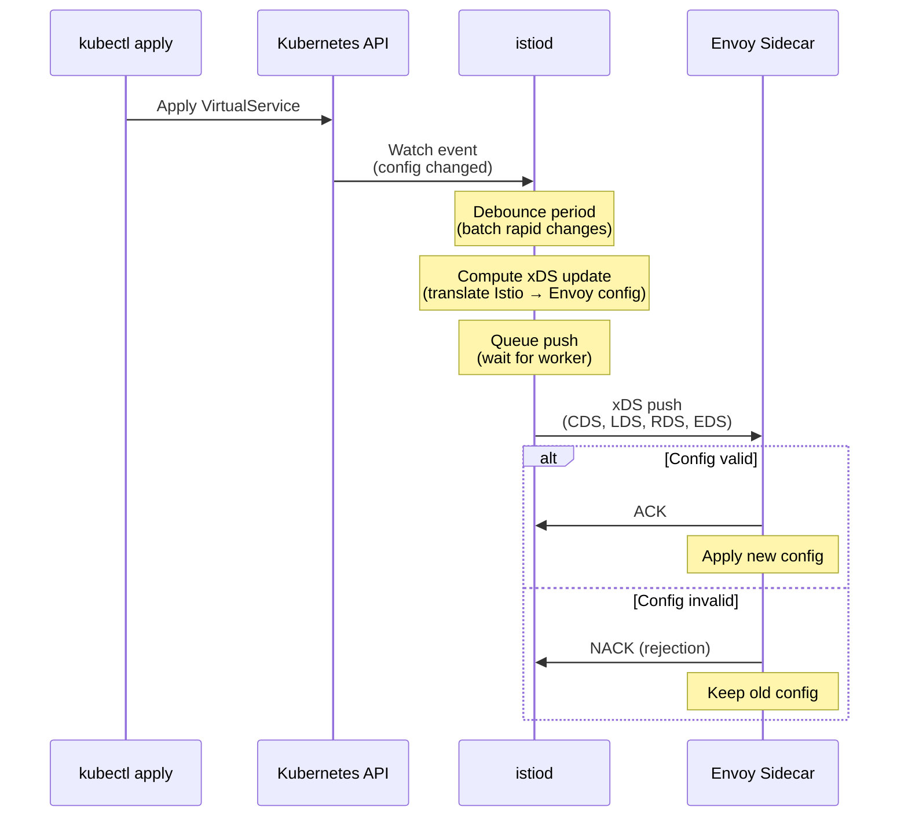
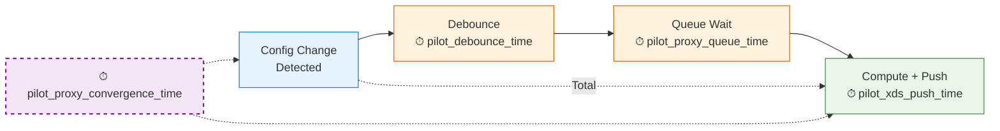
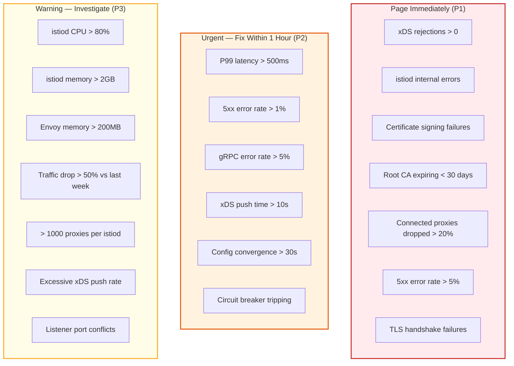

> *This is **Part 2 of 2** in the Istio Observability series. This post covers the **control plane** (istiod). [Part 1 covers the **data plane** (HTTP, TLS, gRPC)](/blog/istio-observability-data-plane/).*

---

## Why Monitor the Control Plane Separately?

The control plane — **istiod** — is the brain of the mesh. It compiles Istio configuration (VirtualServices, DestinationRules, etc.) into Envoy xDS configuration and pushes it to every sidecar. It also manages mTLS certificates via its built-in CA.

A healthy data plane depends entirely on a healthy control plane:

- If istiod is **slow**, sidecars receive stale routing rules and traffic shifts are delayed
- If istiod is **overloaded**, new pods can't join the mesh and certificate rotation stalls
- If istiod is **pushing bad config**, sidecars silently reject updates and continue with old rules — a failure mode that `kubectl apply` will never surface

Most teams invest heavily in data plane observability (request latency, error rates) but have zero visibility into whether their config changes are actually reaching their proxies. This post fixes that.

---

## How the Control Plane Works (The Metrics Context)

Before diving into metrics, it helps to understand the flow that istiod goes through when you apply a configuration change:



Each step in this flow has a corresponding metric. Together they tell you the complete story of configuration health.

---

## Golden Signal 1: Latency (Configuration Push Time)

**What it measures:** How long it takes for istiod to process a configuration change and push the updated xDS config to all affected sidecars.

This is the single most important control plane metric. If push latency is high, your deployments, traffic shifts, and security policy changes all have a hidden delay.

**Key metrics:**

| Metric | Type | Description |
|--------|------|-------------|
| `pilot_xds_push_time` | Histogram | Time to compute and push an xDS update |
| `pilot_proxy_convergence_time` | Histogram | Total time from config change to proxy receiving the update |
| `pilot_debounce_time` | Histogram | Time spent debouncing config changes before triggering a push |
| `pilot_proxy_queue_time` | Histogram | Time a push spends waiting in the push queue |

**How these metrics relate:**



**PromQL queries:**

```promql
# P99 xDS push time
histogram_quantile(0.99,
  sum(rate(pilot_xds_push_time_bucket[5m])) by (le)
)

# P99 total convergence time (config change → proxy updated)
histogram_quantile(0.99,
  sum(rate(pilot_proxy_convergence_time_bucket[5m])) by (le)
)

# Push queue wait time (indicates istiod is backlogged)
histogram_quantile(0.99,
  sum(rate(pilot_proxy_queue_time_bucket[5m])) by (le)
)

# Debounce time (how long istiod waits to batch changes)
histogram_quantile(0.50,
  sum(rate(pilot_debounce_time_bucket[5m])) by (le)
)
```

**What to alert on:**

```yaml
# Alert: xDS push time exceeds 10 seconds
- alert: SlowXDSPush
  expr: |
    histogram_quantile(0.99,
      sum(rate(pilot_xds_push_time_bucket[5m])) by (le)
    ) > 10
  for: 5m
  labels:
    severity: warning
  annotations:
    summary: "istiod xDS push P99 >10s — sidecars are receiving stale config"

# Alert: Total convergence time exceeds 30 seconds
- alert: SlowConfigConvergence
  expr: |
    histogram_quantile(0.99,
      sum(rate(pilot_proxy_convergence_time_bucket[5m])) by (le)
    ) > 30
  for: 5m
  labels:
    severity: critical
  annotations:
    summary: "Config convergence P99 >30s — config changes are severely delayed"

# Alert: Push queue backlog
- alert: XDSPushQueueBacklog
  expr: |
    histogram_quantile(0.99,
      sum(rate(pilot_proxy_queue_time_bucket[5m])) by (le)
    ) > 5
  for: 5m
  labels:
    severity: warning
  annotations:
    summary: "istiod push queue backlogged — config updates are delayed"
```

**What healthy looks like:**

| Metric | Healthy | Degraded | Critical |
|--------|---------|----------|----------|
| P99 push time | < 2s | 2–10s | > 10s |
| P99 convergence | < 5s | 5–30s | > 30s |
| P99 queue time | < 1s | 1–5s | > 5s |

If push times are high, the likely causes are:
- Too many proxies for one istiod replica
- Too many Istio config objects (use `Sidecar` resources to reduce scope)
- Insufficient CPU/memory on istiod pods
- Frequent config changes causing push storms

---

## Golden Signal 2: Traffic (xDS Push Volume)

**What it measures:** How much configuration is being pushed and how many proxies istiod is managing.

**Key metrics:**

| Metric | Type | Description |
|--------|------|-------------|
| `pilot_xds_pushes` | Counter | Total xDS pushes, labeled by type (cds, lds, eds, rds) |
| `pilot_xds` | Gauge | Number of connected xDS clients (sidecars) |
| `pilot_services` | Gauge | Total services known to istiod |
| `pilot_virt_services` | Gauge | Total VirtualService objects |
| `pilot_xds_config_size_bytes` | Histogram | Size of xDS config pushed to each proxy |

**PromQL queries:**

```promql
# xDS pushes per second, by type
sum(rate(pilot_xds_pushes[5m])) by (type)

# Number of connected sidecars
pilot_xds

# Total services in the mesh
pilot_services

# Config size being pushed (helps identify bloated configs)
histogram_quantile(0.99,
  sum(rate(pilot_xds_config_size_bytes_bucket[5m])) by (le)
)

# Push rate trending (should be steady, spikes = config churn)
sum(rate(pilot_xds_pushes[5m]))
```

**What to alert on:**

```yaml
# Alert: Number of connected proxies dropped
- alert: ConnectedProxiesDrop
  expr: |
    pilot_xds < (pilot_xds offset 10m) * 0.8
  for: 5m
  labels:
    severity: critical
  annotations:
    summary: "Connected proxy count dropped >20% — sidecars may be disconnecting"

# Alert: Excessive push rate (config churn)
- alert: ExcessiveXDSPushRate
  expr: |
    sum(rate(pilot_xds_pushes[5m])) > 100
  for: 10m
  labels:
    severity: warning
  annotations:
    summary: "istiod pushing >100 xDS updates/sec — check for config flapping"
```

**What to watch for:**

- **Push rate spikes** correlate with config changes. A steady background push rate of 1-10/sec is normal (endpoint updates from pod scaling). Spikes of 100+/sec suggest config flapping or a runaway operator.
- **Config size** growing over time indicates config bloat. Large configs increase push time and proxy memory. Use `Sidecar` resources to limit which services each proxy knows about.
- **Connected proxy count** should match your expected pod count. A drop means sidecars are disconnecting — check for istiod restarts, network issues, or OOM kills.

---

## Golden Signal 3: Errors (Push Failures and Rejections)

**What it measures:** Configuration that fails to compile or gets rejected by sidecars. This is the most undermonitored control plane signal — and arguably the most critical.

**Why this matters:** When a proxy NACKs (rejects) an xDS update, it continues running with the **previous config**. This means your latest VirtualService or DestinationRule change **didn't take effect** on that proxy. But `kubectl apply` succeeded. There's no error in the Kubernetes events. The only way to know is through these metrics.

**Key metrics:**

| Metric | Type | Description |
|--------|------|-------------|
| `pilot_xds_cds_reject` | Counter | CDS updates rejected by proxies |
| `pilot_xds_lds_reject` | Counter | LDS updates rejected by proxies |
| `pilot_xds_eds_reject` | Counter | EDS updates rejected by proxies |
| `pilot_xds_rds_reject` | Counter | RDS updates rejected by proxies |
| `pilot_total_xds_internal_errors` | Counter | Internal errors in istiod's xDS server |
| `pilot_total_xds_rejects` | Counter | Total xDS rejections across all types |
| `pilot_conflict_inbound_listener` | Gauge | Port conflicts in listener configuration |
| `pilot_conflict_outbound_listener_http_over_current_tcp` | Gauge | Protocol detection conflicts |
| `galley_validation_failed` | Counter | Config validation failures at admission time |

**PromQL queries:**

```promql
# Total xDS rejections per second
sum(rate(pilot_total_xds_rejects[5m]))

# Rejections by type (which xDS resource is being rejected)
sum(rate(pilot_xds_cds_reject[5m]))  # Cluster config rejected
sum(rate(pilot_xds_lds_reject[5m]))  # Listener config rejected
sum(rate(pilot_xds_eds_reject[5m]))  # Endpoint config rejected
sum(rate(pilot_xds_rds_reject[5m]))  # Route config rejected

# Internal errors in istiod (bugs or resource exhaustion)
sum(rate(pilot_total_xds_internal_errors[5m]))

# Listener conflicts (common cause of subtle routing bugs)
pilot_conflict_inbound_listener
pilot_conflict_outbound_listener_http_over_current_tcp

# Config validation failures at admission
sum(rate(galley_validation_failed[5m]))
```

**What to alert on:**

```yaml
# Alert: Any xDS rejections (proxy is refusing config)
- alert: XDSConfigRejected
  expr: |
    sum(rate(pilot_total_xds_rejects[5m])) > 0
  for: 5m
  labels:
    severity: critical
  annotations:
    summary: "Proxies are rejecting xDS config — check istiod logs for invalid configuration"

# Alert: istiod internal errors
- alert: IstiodInternalErrors
  expr: |
    sum(rate(pilot_total_xds_internal_errors[5m])) > 0
  for: 5m
  labels:
    severity: critical
  annotations:
    summary: "istiod is experiencing internal errors"

# Alert: Listener port conflicts
- alert: ListenerConflicts
  expr: pilot_conflict_inbound_listener > 0
  for: 1m
  labels:
    severity: warning
  annotations:
    summary: "Port conflicts detected — services may have overlapping ports"
```

**Debugging rejections:**

When you see xDS rejections, check the istiod logs for the NACK details:

```bash
# Find which proxies are rejecting config
kubectl logs deploy/istiod -n istio-system | grep -i "nack"

# Check a specific proxy's sync status
istioctl proxy-status

# Output shows SYNCED vs NOT SENT vs STALE
# NAME             CDS    LDS    EDS    RDS    ECDS   ISTIOD
# pod-abc.default  SYNCED SYNCED SYNCED SYNCED        istiod-xyz
# pod-def.default  SYNCED STALE  SYNCED SYNCED        istiod-xyz
#                         ^^^^^
#                         This proxy has stale listener config
```

Common causes of rejections:
- **Duplicate listener ports** — two services claiming the same port
- **Invalid regex** in VirtualService match rules
- **Incompatible Envoy version** — istiod generating config that the proxy version doesn't understand
- **Resource limits** — config too large for the proxy to accept

---

## Golden Signal 4: Saturation (istiod Resource Pressure)

**What it measures:** How close istiod is to its operational limits.

**Key metrics:**

| Metric | Type | Description |
|--------|------|-------------|
| `process_cpu_seconds_total` | Counter | istiod CPU usage |
| `go_memstats_alloc_bytes` | Gauge | istiod heap memory |
| `go_goroutines` | Gauge | Number of goroutines (proxy connection pressure) |
| `pilot_xds` | Gauge | Connected proxies (primary scaling dimension) |
| `citadel_server_csr_count` | Counter | Certificate signing requests |
| `citadel_server_success_cert_issuance_count` | Counter | Successful cert issuances |
| `citadel_server_csr_parsing_err_count` | Counter | Failed CSR parsing |

**PromQL queries:**

```promql
# istiod CPU usage (cores)
rate(process_cpu_seconds_total{app="istiod"}[5m])

# istiod memory (MB)
go_memstats_alloc_bytes{app="istiod"} / 1024 / 1024

# Goroutine count (scales with connected proxies)
go_goroutines{app="istiod"}

# Certificate issuance rate
sum(rate(citadel_server_success_cert_issuance_count[5m]))

# CSR failures (certificate rotation problems)
sum(rate(citadel_server_csr_parsing_err_count[5m]))

# Ratio: proxies per istiod replica (sizing metric)
pilot_xds / count(up{app="istiod"})
```

**What to alert on:**

```yaml
# Alert: istiod CPU is saturated
- alert: IstiodHighCPU
  expr: |
    rate(process_cpu_seconds_total{app="istiod"}[5m]) > 0.8
  for: 10m
  labels:
    severity: warning
  annotations:
    summary: "istiod CPU utilization >80% — consider scaling istiod replicas"

# Alert: istiod memory pressure
- alert: IstiodHighMemory
  expr: |
    go_memstats_alloc_bytes{app="istiod"} > 2 * 1024 * 1024 * 1024
  for: 10m
  labels:
    severity: warning
  annotations:
    summary: "istiod memory usage >2GB — check for config bloat or proxy count"

# Alert: Certificate signing failures
- alert: CertSigningFailures
  expr: |
    sum(rate(citadel_server_csr_parsing_err_count[5m])) > 0
  for: 5m
  labels:
    severity: critical
  annotations:
    summary: "Certificate signing failures — mTLS certificate rotation may be broken"

# Alert: Too many proxies per istiod (scaling threshold)
- alert: IstiodOverloaded
  expr: |
    pilot_xds / count(up{app="istiod"}) > 1000
  for: 5m
  labels:
    severity: warning
  annotations:
    summary: "istiod managing >1000 proxies per replica — consider horizontal scaling"
```

**Sizing guidance:**

| Cluster Size | istiod Replicas | CPU (per replica) | Memory (per replica) |
|-------------|----------------|-------------------|---------------------|
| < 500 proxies | 1–2 | 1 core | 1 GB |
| 500–1500 proxies | 2–3 | 2 cores | 2 GB |
| 1500–5000 proxies | 3–5 | 4 cores | 4 GB |
| 5000+ proxies | 5+ | 4+ cores | 8+ GB |

**Tips for reducing istiod load:**
- Use `Sidecar` resources to scope which services each proxy sees — this is the single biggest lever
- Reduce unnecessary config objects (delete unused VirtualServices, DestinationRules)
- Increase the debounce period (`PILOT_DEBOUNCE_AFTER` and `PILOT_DEBOUNCE_MAX`) to batch more changes per push
- Use `discoverySelectors` in the mesh config to limit which namespaces istiod watches

---

## Certificate Health: The Hidden Control Plane Dependency

istiod's built-in CA (formerly Citadel) manages mTLS certificates for every sidecar in the mesh. Certificate rotation failures are silent and devastating — when a certificate expires, all mTLS connections to that pod fail with TLS handshake errors.

**Key metrics for certificate health:**

| Metric | Type | Description |
|--------|------|-------------|
| `citadel_server_csr_count` | Counter | Total CSR requests received |
| `citadel_server_success_cert_issuance_count` | Counter | Successful certificate issuances |
| `citadel_server_csr_parsing_err_count` | Counter | CSR parsing failures |
| `citadel_server_authentication_failure_count` | Counter | Authentication failures during CSR |
| `citadel_server_root_cert_expiry_timestamp` | Gauge | Root CA expiry (Unix timestamp) |

**PromQL queries:**

```promql
# Certificate issuance success rate
sum(rate(citadel_server_success_cert_issuance_count[5m]))
/
sum(rate(citadel_server_csr_count[5m]))

# Time until root CA expires (days)
(citadel_server_root_cert_expiry_timestamp - time()) / 86400

# CSR failures
sum(rate(citadel_server_csr_parsing_err_count[5m]))
+ sum(rate(citadel_server_authentication_failure_count[5m]))
```

**What to alert on:**

```yaml
# Alert: Root CA expires within 30 days
- alert: RootCAExpiringSoon
  expr: |
    (citadel_server_root_cert_expiry_timestamp - time()) / 86400 < 30
  for: 1h
  labels:
    severity: critical
  annotations:
    summary: "Istio root CA expires in {{ $value | humanizeDuration }} — rotate immediately"

# Alert: Certificate issuance failures
- alert: CertIssuanceFailures
  expr: |
    sum(rate(citadel_server_csr_parsing_err_count[5m]))
    + sum(rate(citadel_server_authentication_failure_count[5m]))
    > 0
  for: 5m
  labels:
    severity: critical
  annotations:
    summary: "Certificate issuance failures — pods may lose mTLS connectivity"
```

Root CA expiry is a **ticking time bomb** in every Istio installation. The default self-signed root CA is valid for 10 years, but if you're using an external CA with shorter validity, this alert is essential.

---

## Control Plane Summary Dashboard

| Panel | Query | Purpose |
|-------|-------|---------|
| Connected Proxies | `pilot_xds` | How many sidecars istiod is managing |
| Push Rate | `sum(rate(pilot_xds_pushes[5m])) by (type)` | Config churn indicator |
| P99 Push Time | `histogram_quantile(0.99, sum(rate(pilot_xds_push_time_bucket[5m])) by (le))` | Config delivery speed |
| P99 Convergence Time | `histogram_quantile(0.99, sum(rate(pilot_proxy_convergence_time_bucket[5m])) by (le))` | End-to-end config propagation |
| xDS Rejections | `sum(rate(pilot_total_xds_rejects[5m]))` | Config that proxies refused |
| Listener Conflicts | `pilot_conflict_inbound_listener` | Misconfiguration indicator |
| istiod CPU | `rate(process_cpu_seconds_total{app="istiod"}[5m])` | Resource saturation |
| istiod Memory | `go_memstats_alloc_bytes{app="istiod"} / 1024^2` | Resource saturation |
| Cert Issuance Rate | `sum(rate(citadel_server_success_cert_issuance_count[5m]))` | CA health |
| Root CA Expiry | `(citadel_server_root_cert_expiry_timestamp - time()) / 86400` | Days until CA expires |
| Goroutines | `go_goroutines{app="istiod"}` | Connection pressure |

---

## The Alert Priority Hierarchy

Combining both data plane and control plane alerts, here's the priority order:



---

## Common Pitfalls

### 1. Not Monitoring xDS Rejections

This is the #1 control plane blind spot. A NACK from a proxy means your config change **didn't take effect**, but nothing in your CI/CD pipeline will tell you. You must alert on `pilot_total_xds_rejects`.

### 2. Ignoring Push Latency

If istiod takes 30 seconds to push config, your blue-green deployments, canary rollouts, and security policy changes all have a 30-second delay. This is invisible without `pilot_xds_push_time`.

### 3. Not Tracking Certificate Expiry

The root CA expiry is a ticking time bomb. When it expires, **all mTLS in the mesh breaks simultaneously**. A single alert on `citadel_server_root_cert_expiry_timestamp` prevents this.

### 4. Scaling istiod Reactively

By the time istiod shows high CPU or memory, push latency is already degraded. Use `pilot_xds` (connected proxy count) as a **leading indicator** — scale istiod before it gets overloaded.

### 5. Config Bloat

Every VirtualService, DestinationRule, and ServiceEntry contributes to the config that istiod computes and pushes to every proxy. In large clusters, unused config objects accumulate and slow down pushes. Regularly audit with:

```bash
# Count config objects
kubectl get virtualservices --all-namespaces --no-headers | wc -l
kubectl get destinationrules --all-namespaces --no-headers | wc -l
kubectl get serviceentries --all-namespaces --no-headers | wc -l
kubectl get envoyfilters --all-namespaces --no-headers | wc -l
```

---

## Conclusion

The control plane is the foundation that everything else depends on. If istiod is healthy — pushing config fast, no rejections, certificates rotating cleanly — the data plane takes care of itself. If istiod is struggling, every service in the mesh feels the pain.

The key metrics to start with:
1. **`pilot_xds_push_time`** — are config changes reaching proxies quickly?
2. **`pilot_total_xds_rejects`** — are proxies actually accepting the config?
3. **`pilot_xds`** — how many proxies are connected?
4. **`citadel_server_root_cert_expiry_timestamp`** — when does the CA expire?

Get these four into a dashboard and set up alerts. Everything else is refinement.

---

*Related posts:*
- *[Part 1: Golden Signals for the Data Plane — HTTP, TLS, and gRPC](/blog/istio-observability-data-plane/)*
- *[Envoy Config Dump Explained](/blog/envoy-config-dump-explained/)*
- *[mTLS Debugging Guide](/blog/mtls-debugging-guide/)*
- *[Local istiod Development Guide](/blog/istiod-local-development-guide/)*
