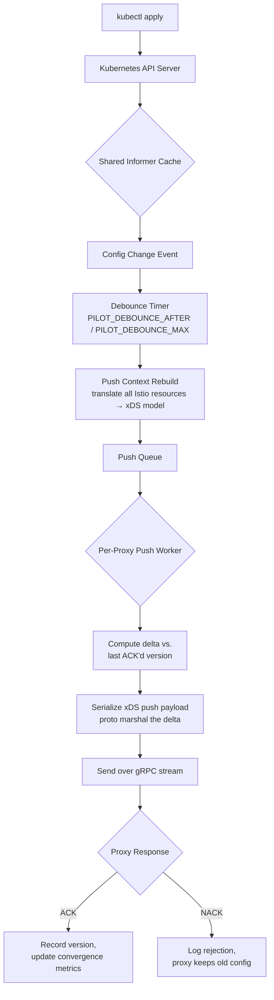

At the core of every Istio deployment is a deceptively simple contract: you define intent in Kubernetes resources (`VirtualService`, `DestinationRule`, `AuthorizationPolicy`), and every Envoy proxy in the mesh gets the right configuration — automatically, within seconds, at any scale. Making that contract hold is istiod's entire job.

This post is a complete technical reference for how istiod manages configuration delivery via xDS: the protocol mechanics, what makes it fast by design, every parameter that degrades performance, scalability limits and how to break through them, and the precise set of metrics that tell you whether your control plane is healthy.

---

## The xDS Protocol: What It Is and Why It Exists

**xDS** (x Discovery Service) is a family of gRPC-based APIs originally designed by the Envoy project for dynamic proxy configuration. The "x" is a placeholder — there are multiple resource types, each with its own discovery service:

| API | Full Name | What It Controls |
|-----|-----------|-----------------|
| **LDS** | Listener Discovery Service | Ports Envoy listens on, filter chains |
| **RDS** | Route Discovery Service | HTTP routing rules (VirtualService → routes) |
| **CDS** | Cluster Discovery Service | Upstream service definitions (DestinationRule → clusters) |
| **EDS** | Endpoint Discovery Service | Pod IP addresses backing each cluster |
| **NDS** | Name Discovery Service | DNS name resolution table |
| **ECDS** | Extension Config Discovery Service | Dynamic Wasm filter configuration |

Envoy proxies establish a **persistent bidirectional gRPC stream** to istiod and subscribe to resource types. Istiod pushes updates on that stream whenever the relevant configuration changes. Proxies respond with an **ACK** (config accepted) or **NACK** (config rejected with a reason).

This is fundamentally different from polling — the proxy does not ask "do you have anything new?" on a timer. Istiod pushes the moment something changes.

---

## How Istiod Translates Configuration: The Full Pipeline

When you run `kubectl apply -f virtual-service.yaml`, here is the exact sequence istiod executes before any proxy receives new config:



**Each stage has a cost.** Understanding which stage dominates your latency is the starting point for any istiod performance investigation.

### Stage 1: Informer Cache

Istiod uses Kubernetes shared informers to watch all relevant resources — Istio CRDs, Services, Endpoints, Namespaces, Pods, Secrets. The informer cache is an in-memory snapshot of Kubernetes state. Reads from it are O(1) and never hit the API server.

| Resource | Intensity | What Makes It High |
|----------|-----------|-------------------|
| CPU | 🟢 **Low** | O(1) reads; event dispatch is lightweight goroutine work |
| Memory | 🔴 **High** | istiod holds a full in-memory copy of every watched Kubernetes object (pods, services, endpoints, namespaces, secrets, Istio CRDs) for every namespace it watches. Each `Endpoints` object for a high-replica service alone can be tens of KB. A cluster with 10,000 pods, 1,000 services, and thousands of `Endpoints` objects pushes the informer cache to 500 MB–1 GB before any mesh config is loaded. |

The memory cost here is often underestimated. A cluster with 10,000 pods, 1,000 services, and thousands of Endpoints objects can push the informer cache alone to 500 MB–1 GB.

### Stage 2: Debouncing

Istiod does not push immediately on every change. It waits for a quiet window so that a rapid sequence of changes (e.g., a rolling deployment updating 50 pods) produces one push, not 50. Two parameters control this:

- **`PILOT_DEBOUNCE_AFTER`** (default: `100ms`) — how long after the *last* event to wait before triggering a push
- **`PILOT_DEBOUNCE_MAX`** (default: `10s`) — the maximum time istiod will keep delaying, even if events keep arriving

| Resource | Intensity | What Makes It High |
|----------|-----------|-------------------|
| CPU | 🟢 **Low** | Timer resets and event queuing; negligible compute |
| Memory | 🟢 **Low** | Buffers only pointers to pending event objects, not copies; bounded by the debounce window |

This is a deliberate trade-off: higher debounce values reduce push frequency (less CPU) but increase propagation latency (slower convergence).

### Stage 3: Push Context Rebuild

This is the most CPU-intensive step. Istiod must re-evaluate all Istio configuration against the current state of Kubernetes to produce a consistent xDS model. This involves:

- Resolving all `VirtualService` host references
- Building the full cluster set from `DestinationRule` and `ServiceEntry` resources
- Evaluating `AuthorizationPolicy` and `PeerAuthentication` for every workload
- Expanding `Sidecar` scoping rules per namespace
- Merging Envoy filter patches from `EnvoyFilter` resources

| Resource | Intensity | What Makes It High |
|----------|-----------|-------------------|
| CPU | 🔴 **High** | Every push cycle re-evaluates the full set of `VirtualService`, `DestinationRule`, `AuthorizationPolicy`, `PeerAuthentication`, and `EnvoyFilter` resources against all services and namespaces. A cluster-wide `EnvoyFilter` alone forces istiod to merge JSON patches against every proxy's config on every rebuild. The more services, policies, and unscoped `Sidecar` resources, the longer each rebuild takes — this is the dominant CPU consumer in large meshes. |
| Memory | 🔴 **High** | The rebuilt push context is a fully materialized xDS object graph covering every service in scope: all clusters, routes, listeners, and endpoints. Without `Sidecar` scoping, this is the complete mesh config held in memory simultaneously — often 1–4 GB at 5,000+ services. Two consecutive push contexts coexist in memory during GC handoff, so peak allocation is up to 2×. |

The cost scales with the number of services, namespaces, and policies — not with the number of proxies. This is important: a mesh with 5,000 services and 10 proxies is just as expensive to rebuild a context for as one with 5,000 proxies.

### Stage 4: Push Queue

After the push context is built, istiod enqueues a push job for every connected proxy that needs an update.

| Resource | Intensity | What Makes It High |
|----------|-----------|-------------------|
| CPU | 🟢 **Low** | Queue operations are O(1); no computation happens here |
| Memory | 🟡 **Medium** | One queue entry per connected proxy per push cycle. At 10,000 proxies, the queue itself holds 10,000 structs simultaneously — not large per entry, but multiplied by push frequency it creates GC pressure. Grows if workers consume the queue slower than pushes arrive (queue backup). |

### Stage 5: Per-Proxy Delta Computation

A pool of workers picks jobs from the queue and computes what changed since each proxy's last ACK'd version. This is why istiod uses **incremental xDS (delta xDS)**: instead of sending a full snapshot, it sends only what changed.

The number of concurrent push workers is controlled by **`PILOT_PUSH_THROTTLE`** (default: `100`).

| Resource | Intensity | What Makes It High |
|----------|-----------|-------------------|
| CPU | 🟡 **Medium** | For each worker, istiod walks the shared push context and extracts the subset relevant to that proxy, then diffs it against the last-ACK'd version. Cost grows with `PILOT_PUSH_THROTTLE` (more concurrent workers) and delta size (more changes = larger diff). A full state-of-world push after a proxy restart is the worst case — no prior ACK'd state means sending the complete config, not just the delta. |
| Memory | 🟡 **Medium** | istiod maintains a version map per proxy (one nonce per xDS type: LDS, RDS, CDS, EDS, NDS). Each entry is small (~1–2 KB), but at 10,000 proxies this totals 1–2 GB of persistent per-proxy state that is never freed while the proxy is connected. This memory does not shrink between push cycles. |

### Stage 6: Serialization

Workers marshal the computed delta into a protobuf-encoded payload ready to write to the gRPC stream. Note: the xDS protocol calls this message a `DiscoveryResponse` — a legacy name from when xDS was purely request/response. In istiod's push model, this is an outgoing *push*, not a reply to anything.

| Resource | Intensity | What Makes It High |
|----------|-----------|-------------------|
| CPU | 🟡 **Medium** | Protobuf marshaling scales directly with payload size. Without `Sidecar` scoping, each response encodes the full mesh config — hundreds of clusters, thousands of routes — which is CPU-intensive. With scoping, the same marshaling cost drops proportionally. A proxy restart triggering a full state-of-world push is the worst-case serialization event. |
| Memory | 🟡 **Medium** | Each worker holds its fully serialized response byte slice in memory until the gRPC write completes. Peak allocation is `PILOT_PUSH_THROTTLE × response_size`. Without scoping: 100 workers × 20 MB = 2 GB held simultaneously just for in-flight serialized payloads. With scoping, the same 100 workers × 400 KB = 40 MB. |

Without `Sidecar` scoping, each response can be 10–50 MB (full mesh config). With scoping, the same response is typically under 500 KB.

### Stage 7: gRPC Send

The serialized response is written to the proxy's persistent gRPC stream.

| Resource | Intensity | What Makes It High |
|----------|-----------|-------------------|
| CPU | 🟢 **Low** | Network I/O; gRPC handles framing and flow control |
| Memory | 🟢 **Low** | gRPC manages its own send buffers independently of istiod's heap |

When proxies are slow to consume data (backpressure), gRPC write calls block the push worker goroutine — tying up a worker slot without additional CPU or memory cost, but increasing queue wait time for other proxies.

### Stage 8: Certificate Issuance (Citadel CA)

Istiod's built-in CA issues and rotates workload mTLS certificates (SVIDs) for every proxy. This runs continuously in the background, independent of xDS pushes. Certificate rotation triggers a targeted xDS push to the affected proxy.

By default, certificates expire after 24 hours with rotation at 80% of TTL (~19.2 hours). At 10,000 proxies, this means istiod signs roughly one certificate every 7 seconds at steady state.

| Resource | Intensity | What Makes It High |
|----------|-----------|-------------------|
| CPU | 🔴 **High** | Every certificate issuance requires an asymmetric crypto signing operation. RSA-2048 signing takes ~1 ms per operation on modern hardware. At 10,000 proxies with a 24h TTL (rotation at 80% = ~19.2h), istiod signs one certificate every ~7 seconds continuously — amounting to roughly 500 signing operations per hour. Short TTLs compound this: a 1h TTL at 10,000 proxies means ~3 signings per second as a constant background load, on top of all xDS push work. |
| Memory | 🟢 **Low** | Signing state is transient; the resulting certificate is small and handed off immediately |

`PILOT_WORKLOAD_CERT_TTL` controls certificate lifetime. Longer TTL reduces rotation frequency and therefore CPU, at the cost of longer exposure windows if a private key is compromised.

### Stage 9: ACK / NACK Handling

After a proxy receives an xDS update, it responds with an ACK (config valid and applied) or NACK (config rejected, reason included). Istiod records the response and updates the proxy's version state.

| Resource | Intensity | What Makes It High |
|----------|-----------|-------------------|
| CPU | 🟢 **Low** | Map update per proxy per resource type |
| Memory | 🟢 **Low** | Small update to existing per-proxy state already tracked in Stage 5 |

NACK handling itself is cheap. The *consequence* of NACKs — proxies staying on stale config, triggering retry pushes — can amplify CPU and memory cost upstream.

---

## Resource Intensity at a Glance

| Pipeline Stage | CPU | Memory | Scales With |
|----------------|-----|--------|-------------|
| Informer Cache | 🟢 Low | 🔴 High | Cluster object count (pods, services, endpoints) |
| Debouncing | 🟢 Low | 🟢 Low | Event rate (bounded by debounce window) |
| Push Context Rebuild | 🔴 High | 🔴 High | Service count × policy complexity |
| Push Queue | 🟢 Low | 🟡 Medium | Connected proxy count |
| Per-Proxy Delta Computation | 🟡 Medium | 🟡 Medium | Proxy count × delta size |
| Serialization | 🟡 Medium | 🟡 Medium | Response payload size (dramatically reduced by Sidecar scoping) |
| gRPC Send | 🟢 Low | 🟢 Low | Network throughput; blocks worker on backpressure |
| Certificate Issuance | 🔴 High | 🟢 Low | Proxy count ÷ certificate TTL |
| ACK / NACK Handling | 🟢 Low | 🟢 Low | Push frequency × proxy count |

---

## Why XDS Is Performant by Design

Several deliberate architectural decisions make istiod's xDS implementation fast:

### 1. Delta XDS (Incremental Updates)

Istiod implements the **delta xDS** protocol (as opposed to state-of-the-world). In state-of-the-world xDS, every push must retransmit the entire resource set — all 500 clusters, all routes — even if only one changed. In delta xDS, only the changed and removed resources are sent.

For large meshes, this is the single biggest performance multiplier. A cluster update that changes 3 out of 400 services sends a payload that is ~200x smaller.

### 2. Per-Proxy Scoping with Sidecar Resources

By default, every proxy receives configuration for every service in the mesh. For a mesh with 500 services, every proxy carries 500 clusters and their routes — even if a given pod only calls 3 services.

The `Sidecar` resource lets you declare explicit egress scope:

```yaml
apiVersion: networking.istio.io/v1beta1
kind: Sidecar
metadata:
  name: default
  namespace: payments
spec:
  egress:
  - hosts:
    - "payments/*"
    - "istio-system/*"
    - "shared-services/redis.shared-services.svc.cluster.local"
```

With this, istiod computes a much smaller xDS response for every proxy in the `payments` namespace. Push size drops, serialization time drops, and network bandwidth drops — all proportionally to how aggressively you scope.

### 3. Shared Push Context

The push context — the computed xDS model — is built once per push cycle and shared across all proxy push operations. Istiod does not recompute routes or clusters 1,000 times for 1,000 proxies. It computes once, then each worker reads from the shared context and extracts the relevant subset.

### 4. Debouncing Batches Rapid Changes

As described above, the debounce window ensures that a rolling deployment of 50 pods — which produces 50 endpoint update events — triggers one push cycle rather than 50. This keeps CPU flat during the most common high-change-rate scenario in production.

### 5. gRPC Streaming (No Connection Overhead)

Proxies hold a persistent gRPC connection to istiod. There is no TCP handshake, no TLS negotiation, no HTTP/1.1 keep-alive overhead per push. A push is simply writing to an already-open stream.

---

## Configuration Parameters That Impact CPU Utilization

These are the levers that directly affect how much CPU istiod consumes. Misconfiguring any of them — or ignoring them as your mesh grows — leads to a CPU-bound control plane.

### Debounce Settings

| Parameter | Default | Effect on CPU |
|-----------|---------|---------------|
| `PILOT_DEBOUNCE_AFTER` | `100ms` | Shorter → more frequent pushes → higher CPU |
| `PILOT_DEBOUNCE_MAX` | `10s` | Lower → pushes trigger even during change storms → higher CPU |

**Rule of thumb:** In a cluster with frequent rolling deployments, increase `PILOT_DEBOUNCE_AFTER` to `200–500ms`. You add latency to config propagation but dramatically cut push frequency.

### Push Throttle

| Parameter | Default | Effect on CPU |
|-----------|---------|---------------|
| `PILOT_PUSH_THROTTLE` | `100` | Higher → more parallelism → spikes in CPU; Lower → slower convergence |

This controls how many proxies istiod pushes to simultaneously. Setting it too high causes CPU spikes during large push waves (e.g., after a full `kubectl rollout restart`). Setting it too low causes push queues to back up and convergence time to grow linearly.

### Scope: The Largest CPU Driver

**Number of services × number of proxies** is the dominant factor in push context build time. Every time the push context rebuilds, istiod evaluates policies against this entire space.

The most impactful CPU-reduction technique is **scoping via `Sidecar` resources**. A mesh with 1,000 services where every proxy is scoped to 20 services has roughly the same push cost as a mesh with 20 services.

### EnvoyFilter Resources

`EnvoyFilter` patches are applied during the push context build and require istiod to merge arbitrary JSON patches into the Envoy config model. Each `EnvoyFilter` adds overhead proportional to how broadly it is scoped. A single cluster-wide `EnvoyFilter` is evaluated against every proxy on every push — it is one of the most CPU-expensive resources per-instance.

**Minimize `EnvoyFilter` usage.** If you need one, scope it tightly to a specific namespace or workload selector.

### ServiceEntry Resources

Each `ServiceEntry` with `MESH_INTERNAL` resolution requires istiod to track endpoints (like a Kubernetes Service) and evaluate it during push context builds. Large numbers of `ServiceEntry` resources — especially those covering external services with many resolution addresses — inflate push context build time significantly.

### Certificate Rotation

Istiod's built-in CA issues and rotates workload certificates (SVIDs). Certificate rotation triggers a targeted push to the affected proxy. By default, certificates expire every 24 hours with rotation happening at 80% of TTL. In large meshes, this creates a constant background push load that is easy to overlook.

You can tune certificate TTL via `PILOT_WORKLOAD_CERT_TTL`. Longer TTL means fewer rotations — but longer exposure if a certificate is compromised.

### Number of Connected Proxies

Each connected proxy maintains a gRPC stream, consumes memory for the connection state, and receives a push job on every push cycle. Istiod CPU scales approximately linearly with proxy count for a given push context size.

---

## Why an XDS Push Slows Down

Push latency degrades for distinct reasons at each pipeline stage. Knowing which stage is slow tells you exactly where to intervene.

### Slow Push Context Build (`pilot_push_context_recompute_count` is high)

**Symptoms:** High `pilot_xds_push_time` percentiles, CPU pegged even outside of deployments.

**Causes:**
- Too many services, `ServiceEntry`, or `AuthorizationPolicy` resources
- Broad `EnvoyFilter` resources forcing full policy re-evaluation
- High-frequency changes preventing debounce from batching (check `pilot_debounce_time`)
- `Sidecar` resources absent — every proxy gets full mesh config

**Fix:** Add `Sidecar` scoping, reduce `EnvoyFilter` breadth, tune debounce upward.

### Long Push Queue Wait (`pilot_proxy_queue_time` is high)

**Symptoms:** Push context builds quickly, but proxies converge slowly. `pilot_proxy_queue_time` p99 is high. Push queue depth grows.

**Causes:**
- `PILOT_PUSH_THROTTLE` too low for the number of connected proxies
- A large push wave (many proxies need updating simultaneously) overwhelms the worker pool
- Slow gRPC sends due to network saturation or proxy-side backpressure

**Fix:** Increase `PILOT_PUSH_THROTTLE` cautiously, or shard the mesh (see below).

### High Serialization Cost

**Symptoms:** Per-proxy push time is high even with a small delta.

**Causes:**
- Proxies are not scoped — each push response is large (many clusters/routes to serialize)
- Delta xDS not fully utilized due to version mismatches after proxy restart (forces full state-of-world push)

**Fix:** Add `Sidecar` scoping, ensure proxies are running Envoy versions that support delta xDS.

### Proxy NACK Rate (`pilot_xds_push_errors` is high)

**Symptoms:** Proxies receive config but reject it. Old config stays in place silently.

**Causes:**
- Invalid `EnvoyFilter` patch (malformed JSON, incompatible with Envoy version)
- `VirtualService` references a host that doesn't exist in scope
- Cluster configuration references a secret that hasn't propagated yet (race condition)

**Fix:** Check istiod logs for NACK reasons. The proxy logs the exact error. This is often a config authoring error, not a performance issue.

### Network Back-Pressure

**Symptoms:** Slow pushes correlating with high network utilization on the istiod pod.

**Causes:**
- gRPC stream backpressure from slow proxies causes istiod push workers to block
- Large push payloads (no `Sidecar` scoping) saturating istiod's egress bandwidth

**Fix:** Scope your mesh with `Sidecar` resources, upgrade to delta xDS, or shard.

---

## Scalability Concerns

### The O(services × proxies) Problem

Istiod's push context build time grows with the number of services and policies, while total push work grows with the number of proxies. Both dimensions independently drive CPU. The combination — large service count *and* large proxy count — is where istiod hits its limits.

In practice, a single istiod instance comfortably handles:
- ~1,000 services with ~1,000 proxies (no scoping needed)
- ~5,000 services with ~5,000 proxies (requires tight `Sidecar` scoping)
- ~10,000+ services or proxies (requires mesh sharding)

These numbers are rough — they depend heavily on the complexity of your policies, `EnvoyFilter` usage, and how aggressively services are scoped.

### Kubernetes API Server Pressure

Istiod watches a large set of Kubernetes resources. In clusters with very high pod churn (HPA scaling, spot instance recycling), the event rate on the Endpoints/EndpointSlice watch can overwhelm the debounce mechanism and keep istiod in a continuous push cycle. Monitor the Kubernetes API server's watch event rate alongside istiod metrics.

### Certificate Issuance at Scale

At 10,000 proxies, with certificates rotating at 80% of a 24-hour TTL (~19.2 hours), istiod issues roughly 1 certificate every 7 seconds continuously. Each issuance is a crypto operation (RSA or ECDSA signing). At very high proxy counts, certificate issuance can become a meaningful fraction of istiod's CPU budget. Consider using an external CA (cert-manager, Vault) to offload signing.

### Memory Growth with Proxy Count

Istiod holds in-memory state for every connected proxy: the last-ACK'd xDS version per resource type, the connection state, and a reference to the push context. Memory grows approximately linearly with proxy count. At 10,000 proxies, istiod typically uses 4–8 GB of RAM.

---

## Metrics to Monitor Istiod Performance

These are the metrics that matter, what they tell you, and what action to take when they trend in the wrong direction.

### Push Latency (Most Important)

| Metric | Type | What to Watch |
|--------|------|---------------|
| `pilot_xds_push_time` | Histogram | Full push duration per xDS type; p99 > 5s is a warning sign |
| `pilot_proxy_convergence_time` | Histogram | End-to-end: config change → proxy ACK; this is the number your users feel |
| `pilot_debounce_time` | Histogram | Time batching changes; high values mean many rapid changes are arriving |
| `pilot_proxy_queue_time` | Histogram | Time waiting for a push worker; high values mean increase `PILOT_PUSH_THROTTLE` or shard |

**Alert thresholds:**
- `pilot_proxy_convergence_time` p99 > 30s → investigate immediately
- `pilot_xds_push_time` p99 > 10s → push context is too expensive; check scoping

### Push Volume

| Metric | Type | What to Watch |
|--------|------|---------------|
| `pilot_xds_pushes` | Counter | Total push count by type (cds, lds, rds, eds); sudden spike = event storm |
| `pilot_push_context_recompute_count` | Counter | Full push context rebuilds; growing faster than deployments = config complexity problem |
| `pilot_total_xds_rejects` | Counter | Proxy NACKs; any sustained non-zero value needs investigation |

### Connected Proxies and Endpoint Health

| Metric | Type | What to Watch |
|--------|------|---------------|
| `pilot_xds_clients` | Gauge | Currently connected proxies; should match your expected sidecar count |
| `pilot_xds_expired_nonce` | Counter | Push nonces timing out; indicates very slow or stalled proxies |
| `endpoint_no_pod` | Gauge | Endpoints in config with no backing pod; stale config |

### Resource Counts (Scaling Indicators)

| Metric | Type | What to Watch |
|--------|------|---------------|
| `pilot_services` | Gauge | Total services istiod is tracking |
| `pilot_virt_services` | Gauge | VirtualService count |
| `pilot_destroy_time_seconds` | Histogram | Time to clean up proxy state on disconnect |

### CPU and Memory

These are standard container metrics but critical for istiod:

| Metric | Threshold to Watch |
|--------|-------------------|
| `container_cpu_usage_seconds_total` (istiod) | Sustained > 80% of request → scale or shard |
| `container_memory_working_set_bytes` (istiod) | Growing without bound → proxy connection leak |
| `go_goroutines` (istiod) | Growing without bound → goroutine leak, often in push workers |

---

## When and How to Shard the Mesh

Sharding means running multiple istiod instances, each responsible for a subset of proxies. It is the correct response when a single istiod cannot handle your proxy count or push frequency — even with optimal scoping and tuning.

### The Metric That Tells You to Shard

> **`pilot_proxy_convergence_time` p99 > 30 seconds sustained, after `Sidecar` scoping is in place.**

This is the definitive signal. If config changes are taking more than 30 seconds to reach proxies at p99, and you have already applied aggressive `Sidecar` scoping and tuned debounce, you need to shard.

A secondary signal is sustained istiod CPU above 80% of its request limit during normal (non-rollout) operation. During rollouts CPU spikes are expected; during steady state they are not.

`pilot_xds_push_time` p99 by itself is insufficient because it only measures one stage. `pilot_proxy_convergence_time` is the end-to-end user-visible latency and is the right sharding trigger.

### How Istio Sharding Works

Istio supports **multiple istiod replicas** with automatic proxy assignment via the `--revision` flag and `istio.io/rev` namespace labels. Each replica is a fully independent control plane with its own watch on the Kubernetes API server, its own push workers, and its own gRPC connections to a subset of proxies.

```yaml
# Deploy a second revision for high-churn namespaces
apiVersion: install.istio.io/v1alpha1
kind: IstioOperator
metadata:
  name: istiod-canary
spec:
  revision: canary
  profile: minimal
```

Proxies in a namespace labeled `istio.io/rev=canary` connect to this instance, completely isolating their push load from the main istiod.

### Sharding Strategies

**By namespace (most common):** Assign high-churn or high-service-count namespaces to a dedicated istiod revision. Traffic-sensitive namespaces (payments, auth) get their own revision so a noisy neighbor can't delay their config convergence.

**By cluster region:** In multi-cluster setups, run a dedicated istiod per region close to the proxies it serves, reducing gRPC stream latency.

**By workload type:** Separate long-lived services from short-lived batch jobs. Batch jobs generate high endpoint churn; isolating them prevents their churn from triggering unnecessary pushes to service proxies.

---

## Remediation Playbook

Use the intensity table above to identify which stages are 🔴 High for CPU or Memory, then apply the fixes below. Start at the highest-impact stage and work down.

### When CPU Is High

#### Push Context Rebuild is the culprit
*Indicated by: `pilot_push_context_recompute_count` rate elevated, `pilot_xds_push_time` p99 high, istiod CPU sustained > 80% even outside rollouts.*

**1. Add `Sidecar` scoping (highest impact)**

This is almost always the right first fix. Without it, every context rebuild evaluates the full service mesh for every proxy.

```yaml
# Apply a default Sidecar to every namespace that restricts egress
# to only what that namespace actually needs
apiVersion: networking.istio.io/v1beta1
kind: Sidecar
metadata:
  name: default
  namespace: my-namespace
spec:
  egress:
  - hosts:
    - "./*"               # all services in same namespace
    - "istio-system/*"   # istiod, Prometheus scrape endpoint
```

One `Sidecar` resource per namespace, applied mesh-wide, can cut push context build time by 60–90% in large meshes.

**2. Restrict or remove `EnvoyFilter` resources**

Each cluster-scoped `EnvoyFilter` is evaluated against every proxy on every push. Audit your `EnvoyFilter` resources:

```bash
kubectl get envoyfilter -A
```

For each one, add a `workloadSelector` to limit its scope:

```yaml
spec:
  workloadSelector:
    labels:
      app: my-gateway   # instead of matching all proxies
```

**3. Increase debounce to batch more aggressively**

```yaml
# istiod deployment env vars
- name: PILOT_DEBOUNCE_AFTER
  value: "300ms"    # default 100ms — increase during high-churn periods
- name: PILOT_DEBOUNCE_MAX
  value: "15s"      # default 10s
```

This trades propagation latency for fewer push cycles. Acceptable for most production meshes where 5–15s convergence is fine.

**4. Reduce `ServiceEntry` complexity**

Replace broad wildcard `ServiceEntry` resources with specific ones. Remove `MESH_INTERNAL` `ServiceEntry` resources that duplicate Kubernetes `Service` objects — istiod tracks them like services and adds them to every context build.

#### Certificate Issuance is the culprit
*Indicated by: CPU elevated during steady state with no active deployments, `citadel_server_csr_count` rate non-trivial.*

**1. Extend certificate TTL**

```yaml
- name: PILOT_WORKLOAD_CERT_TTL
  value: "48h"    # default 24h — doubles the interval between rotations
```

Balance against your security posture: longer TTL means longer exposure if a key is compromised.

**2. Switch from RSA to ECDSA**

ECDSA P-256 signing is roughly 10x faster than RSA-2048 for the same security level. Configure istiod to issue ECDSA certificates:

```yaml
- name: CITADEL_SELF_SIGNED_CA_CERT_TTL
  value: "87600h"
- name: PILOT_CERT_PROVIDER
  value: "istiod"
```

In your `MeshConfig`:
```yaml
meshConfig:
  defaultConfig:
    privateKeyProvider:
      cryptomb: {}  # enables hardware-accelerated ECDSA where available
```

**3. Offload to an external CA**

Delegate all certificate signing to cert-manager, HashiCorp Vault, or AWS ACM PCA. Istiod handles the CSR flow but does not perform signing:

```yaml
- name: EXTERNAL_CA
  value: "true"
- name: CA_ADDR
  value: "cert-manager-istio-csr.cert-manager.svc:443"
```

This removes certificate issuance CPU from istiod entirely.

#### Push workers are saturated
*Indicated by: `pilot_proxy_queue_time` p99 elevated, `pilot_xds_clients` high.*

**1. Tune `PILOT_PUSH_THROTTLE`**

Increase cautiously — higher values spike CPU:

```yaml
- name: PILOT_PUSH_THROTTLE
  value: "200"    # default 100
```

**2. Shard the mesh by proxy count**

If CPU is high primarily because of the number of connected proxies (not context complexity), shard by splitting namespaces across istiod revisions. Each revision handles a fraction of the total proxy count.

---

### When Memory Is High

#### Informer Cache is the culprit
*Indicated by: memory growing in proportion to cluster object count (pods, services, endpoints), not to mesh config complexity.*

**1. Enable EndpointSlice instead of Endpoints**

EndpointSlice is more granular and produces smaller watch events than the monolithic `Endpoints` object. Ensure istiod is configured to use it (default in Kubernetes 1.21+):

```yaml
- name: PILOT_USE_ENDPOINT_SLICE
  value: "true"
```

**2. Filter watched namespaces**

If your mesh only spans a subset of namespaces, configure istiod to watch only those:

```yaml
- name: WATCHED_NAMESPACES
  value: "payments,auth,shared-services,istio-system"
```

This prevents the informer cache from holding state for namespaces that have no mesh workloads, which is common in large multi-tenant clusters.

**3. Increase istiod memory limits**

If the informer cache size is legitimately driven by cluster scale, set memory limits accordingly and ensure istiod is on nodes with sufficient headroom:

```yaml
resources:
  requests:
    memory: "2Gi"
  limits:
    memory: "8Gi"
```

#### Push Context is the culprit
*Indicated by: memory spikes coinciding with push cycles, proportional to service count.*

The push context holds the full xDS model for the mesh in memory during each push cycle. This is the same root cause as the CPU issue — too many services in scope.

**1. Add `Sidecar` scoping (same fix as CPU)**

Scoping reduces not just CPU but the size of the push context itself. A proxy scoped to 20 services generates a context object that is ~25x smaller than one scoped to the full mesh. With many workers running simultaneously, this multiplies into significant memory savings.

**2. Tune `PILOT_PUSH_THROTTLE` downward**

Each concurrent worker holds a serialized xDS payload in memory. Reducing throttle reduces peak memory allocation during large push waves:

```yaml
- name: PILOT_PUSH_THROTTLE
  value: "50"    # trade convergence speed for memory headroom
```

**3. Reduce `AuthorizationPolicy` and `PeerAuthentication` count**

These are evaluated per-workload during context build and contribute to context size. Consolidate overlapping policies where possible. A single namespace-scoped `AuthorizationPolicy` is cheaper than one per workload.

#### Per-proxy state is the culprit
*Indicated by: memory growing linearly with `pilot_xds_clients`, not with push frequency or service count.*

**1. Shard the mesh**

The cleanest solution when memory growth is driven purely by proxy count. Each istiod revision holds state for a fraction of the proxies.

**2. Audit zombie connections**

Watch `pilot_xds_clients` against your expected sidecar count. If clients exceed expected, you have zombie connections from pods that terminated without cleanly closing their gRPC stream. This is common with spot/preemptible nodes:

```bash
# Expected sidecar count
kubectl get pods -A -l security.istio.io/tlsMode=istio | wc -l

# Actual connections
kubectl exec -n istio-system deploy/istiod -- \
  curl -s localhost:15014/metrics | grep pilot_xds_clients
```

If the gap is large, check `pilot_destroy_time_seconds` — long destroy times indicate istiod is slow to clean up disconnected proxy state, which temporarily leaks memory.

**3. Increase `PILOT_DEBOUNCE_AFTER` to reduce push context churn**

Frequent push cycles mean the old push context must remain in memory until all in-flight workers finish with it before GC can collect it. Higher debounce reduces the overlap between successive push contexts, lowering peak memory.

---

## Recommended Grafana Dashboard Panels

A minimal istiod monitoring dashboard should include these panels in order of importance:

```
Row 1: Health Summary
  - pilot_proxy_convergence_time (p50, p95, p99) — line chart
  - pilot_total_xds_rejects rate — stat panel (0 is green)
  - pilot_xds_clients — stat panel

Row 2: Push Pipeline Breakdown
  - pilot_debounce_time p99
  - pilot_xds_push_time p99 by xDS type (cds/lds/rds/eds)
  - pilot_proxy_queue_time p99

Row 3: Volume
  - pilot_xds_pushes rate by type
  - pilot_push_context_recompute_count rate

Row 4: Resources
  - pilot_services, pilot_virt_services — gauges
  - istiod container CPU % of request
  - istiod container memory working set
```

---

## Summary

| Topic | Key Takeaway |
|-------|-------------|
| **Protocol** | xDS is a persistent gRPC subscription model — push, not poll |
| **Pipeline** | Debounce → context build → queue → per-proxy delta → send → ACK/NACK |
| **Performance** | Delta xDS + `Sidecar` scoping + debounce batching are the three pillars |
| **CPU drivers** | Push context rebuild (🔴 High) and certificate issuance (🔴 High) are the two dominant costs |
| **Memory drivers** | Informer cache (🔴 High) and push context size (🔴 High) scale with cluster and service count |
| **Push slowdowns** | Context build time, queue depth, serialization size, NACK rate — each has a distinct fix |
| **Scale limits** | ~5,000 services × 5,000 proxies with scoping; beyond that, shard |
| **Shard trigger** | `pilot_proxy_convergence_time` p99 > 30s after scoping is in place |
| **Top metric** | `pilot_proxy_convergence_time` — the only metric that captures the full user-visible latency |
| **First fix, always** | Add `Sidecar` scoping — it reduces CPU, memory, push size, and convergence time simultaneously |
