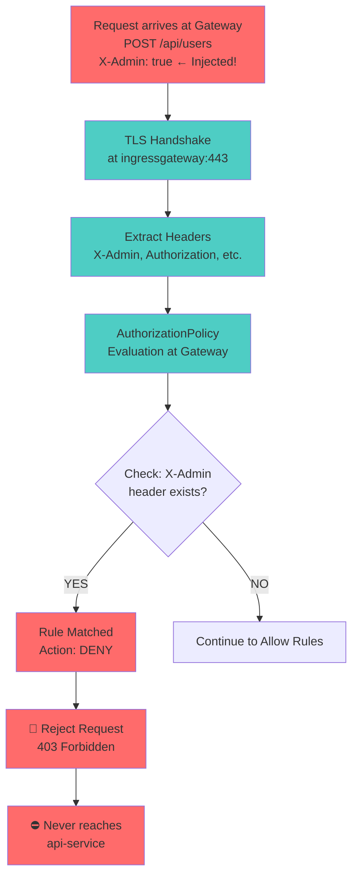
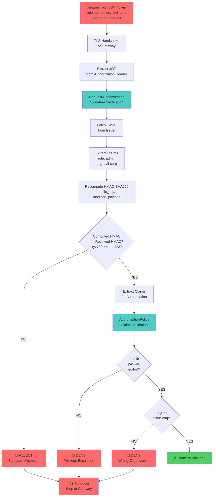
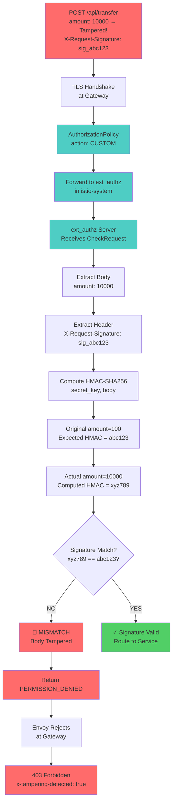

## What is Tamper Detection?

**Tamper detection** is the ability to identify when data has been modified, either intentionally by an attacker or accidentally through corruption. At the Istio Gateway layer, tamper detection protects your mesh from malicious external traffic by verifying that incoming requests haven't been altered.

### Why Detect Tampering at the Gateway?

The Istio Gateway is your mesh's **first line of defense** against external attacks:

```
Internet Traffic
      ↓ (untrusted!)
┌─────────────────┐
│ Istio Gateway   │ ← Tamper detection here catches problems early
│ (EntryPoint)    │
└────────┬────────┘
         ↓
┌─────────────────┐
│ Internal Mesh   │ ← Mesh traffic already protected by mTLS
│ Services        │
└─────────────────┘
```

**Key benefits of gateway-level tamper detection:**

1. **Reject malicious traffic early**: Stop attacks before they reach your services
2. **Reduce internal processing**: Don't waste CPU validating obviously bad requests
3. **Attack surface reduction**: Prevent tampering before it becomes a problem
4. **Compliance**: Many standards require detecting tampering at entry points

---

## Tamper Detection Mechanisms

Istio provides multiple mechanisms to detect tampering at the gateway layer. Each works differently and protects against different attack types.

### 1. mTLS with Client Certificates

**What it does:** Ensures the client identity is verified before any payload is examined.

```
Client with cert          Istio Gateway
   │                            │
   │ TLS ClientHello           │
   ├───────────────────────────>│
   │                            │
   │ ServerHello + Cert        │
   │<────────────────────────────│
   │                            │
   │ ClientCertificate         │
   ├───────────────────────────>│ ← Gateway validates cert signature
   │                            │
   │ Handshake complete        │
   │                            │
   │ Encrypted request         │
   ├───────────────────────────>│ (HMAC protects every byte)
```

**Gateway Configuration with mTLS:**

```yaml
apiVersion: networking.istio.io/v1beta1
kind: Gateway
metadata:
  name: api-gateway
spec:
  selector:
    istio: ingressgateway
  servers:
  - port:
      number: 443
      name: https
      protocol: HTTPS
    tls:
      mode: MUTUAL  # Require client certificates
      credentialName: gateway-ca
      # Gateway validates:
      # 1. Client cert is signed by trusted CA
      # 2. Client cert not expired
      # 3. Client cert subject matches allowlist (optional)
    hosts:
    - "api.example.com"
```

**Attack Prevention:**

```
Attacker without valid cert:
┌─────────────┐         ┌──────────────┐
│ Attacker    │         │ Istio Gate   │
│ (no cert)   │         │              │
└──────┬──────┘         └──────┬───────┘
       │ TLS ClientHello      │
       ├─────────────────────>│
       │                      │
       │ ServerHello         │
       │<─────────────────────│
       │                      │
       │ ClientCertificate   │
       │ (self-signed, fake) │
       ├─────────────────────>│
       │                      │ Verify cert:
       │                      │ ✗ Not signed by trusted CA
       │                      │
       │ TLS Alert           │
       │<─────────────────────│ (connection rejected)
```

**Limitations:**

- Requires all clients to have valid certificates
- Difficult to implement for external third-party integrations
- Client cert management overhead

---

### 2. JWT Signature Validation with RequestAuthentication

**What it does:** Verifies that JWT tokens haven't been tampered with by checking the cryptographic signature.

```
Client                    Istio Gateway
   │                            │
   │ HTTP Request              │
   │ + JWT token               │
   ├───────────────────────────>│
   │                            │ RequestAuthentication:
   │                            │ 1. Extract JWT from header
   │                            │ 2. Fetch JWKS (public keys)
   │                            │ 3. Verify signature
   │                            │ 4. Check expiry (iat, exp)
   │                            │
   │ If valid: Inject claims   │
   │ as request attributes     │
```

**Gateway Configuration with JWT:**

```yaml
apiVersion: security.istio.io/v1beta1
kind: RequestAuthentication
metadata:
  name: jwt-auth
  namespace: istio-system  # Gateway namespace
spec:
  selector:
    matchLabels:
      istio: ingressgateway  # Apply to ingress gateway
  jwtRules:
  - issuer: "https://auth.example.com"
    jwksUri: "https://auth.example.com/.well-known/jwks.json"
    audiences:
    - "api.example.com"
```

**How JWT Detects Tampering:**

```
Normal JWT:
header.payload.signature

If attacker modifies payload:
header.modified_payload.signature (old signature)

Gateway verification:
1. Take header + payload
2. Compute: HMAC-SHA256(public_key, header.payload)
3. Compare with provided signature
4. Signature doesn't match! → Reject

Why can't attacker forge signature?
- Signature is computed with issuer's PRIVATE key
- Attacker only has PUBLIC key (from JWKS)
- Can't reverse HMAC-SHA256 to forge signature
```

**Example Attack and Prevention:**

```
Original JWT:
eyJhbGciOiJIUzI1NiIsInR5cCI6IkpXVCJ9.
eyJ1c2VyIjoiYWxpY2UiLCJyb2xlIjoidmlld2VyIn0.
signature123

Attacker modifies role to "admin":
eyJhbGciOiJIUzI1NiIsInR5cCI6IkpXVCJ9.
eyJ1c2VyIjoiYWxpY2UiLCJyb2xlIjoiYWRtaW4ifQ.
signature123  ← Old signature, still there

Gateway verification:
1. Decode: user=alice, role=admin
2. Compute new signature: HMAC-SHA256(key, header.payload)
3. New signature ≠ signature123
4. ✗ Signature mismatch → Request rejected
5. ✗ Role privilege escalation prevented
```

**Limitations:**

- Requires clients to obtain JWT from trusted issuer
- Doesn't validate request body, only token claims
- Clock skew can cause false rejections

---

### 3. AuthorizationPolicy with Claim Validation

**What it does:** After RequestAuthentication extracts claims, AuthorizationPolicy can validate the contents and enforce rules.

```yaml
apiVersion: security.istio.io/v1beta1
kind: AuthorizationPolicy
metadata:
  name: api-authz
  namespace: istio-system
spec:
  selector:
    matchLabels:
      istio: ingressgateway
  action: ALLOW
  rules:
  - from:
    - source:
        requestPrincipals: ["https://auth.example.com/users/*"]  # From JWT issuer
    to:
    - operation:
        methods: ["GET"]
        paths: ["/api/v1/data"]
    when:
    - key: request.auth.claims[role]
      values: ["viewer", "editor"]  # Only these roles allowed
    - key: request.auth.claims[org]
      values: ["acme-corp"]  # Only this org
    - key: request.auth.claims[exp]
      values: ["*"]  # Token must have expiry claim
```

**Tamper Detection in Action:**

```
Attacker intercepts and modifies JWT claims
(even though signature is still invalid):

Original claim: {"org": "acme-corp", "role": "viewer"}
Modified claim: {"org": "evil-corp", "role": "admin"}

Even if somehow signature passed (it won't):
AuthorizationPolicy checks:
1. org == "acme-corp"? No, it's "evil-corp" → DENY
2. Even if org matched, role == "viewer|editor"? No → DENY

Defense in depth: Multiple layers reject tampering
```

---

### 4. Custom Validation with ext_authz

**What it does:** For complex tamper detection beyond JWT, use a custom authorization server.

```yaml
apiVersion: v1
kind: ConfigMap
metadata:
  name: mesh-config
  namespace: istio-system
data:
  mesh: |
    extensionProviders:
    - name: ext-authz-server
      envoyExtAuthzGrpc:
        service: ext-authz.default.svc.cluster.local
        port: 9000
        timeout: 5s
---
apiVersion: security.istio.io/v1beta1
kind: AuthorizationPolicy
metadata:
  name: ext-authz-policy
  namespace: istio-system
spec:
  selector:
    matchLabels:
      istio: ingressgateway
  action: CUSTOM
  provider:
    name: ext-authz-server
  rules:
  - to:
    - operation:
        paths: ["/api/v1/*"]
```

**Custom Tamper Detection Logic:**

```go
// Custom ext_authz server
func Authorize(ctx context.Context, req *authv3.CheckRequest) (*authv3.CheckResponse, error) {
    // Extract request details
    headers := req.Attributes.Request.Http.Headers
    body := req.Attributes.Request.Http.Body
    
    // Detect tampering:
    
    // 1. Check Content-Length matches actual body
    contentLength := headers["content-length"]
    if len(body) != parsedLength {
        return Deny("Content-Length mismatch - likely tampered")
    }
    
    // 2. Verify request signature if client provided one
    if signature := headers["x-request-signature"]; signature != "" {
        computed := HMAC-SHA256(secret_key, body)
        if signature != computed {
            return Deny("Request signature invalid - content tampered")
        }
    }
    
    // 3. Check for suspicious patterns
    if containsSQLInjection(body) || containsXSS(body) {
        return Deny("Tampered request detected - malicious payload")
    }
    
    // 4. Validate request freshness (nonce/timestamp)
    if isReplay(req) {
        return Deny("Replay attack detected")
    }
    
    return Allow()
}
```

---

## Real-World Attack Scenarios and Prevention

### Scenario 1: Header Injection Attack

#### Gateway Enforcement Configuration

```yaml
# Step 1: Define Gateway
apiVersion: networking.istio.io/v1beta1
kind: Gateway
metadata:
  name: secure-gateway
  namespace: istio-system
spec:
  selector:
    istio: ingressgateway
  servers:
  - port:
      number: 443
      name: https
      protocol: HTTPS
    tls:
      mode: SIMPLE
      credentialName: gateway-cert
    hosts:
    - "api.example.com"

---
# Step 2: Route traffic
apiVersion: networking.istio.io/v1beta1
kind: VirtualService
metadata:
  name: api-routes
  namespace: istio-system
spec:
  hosts:
  - "api.example.com"
  gateways:
  - secure-gateway
  http:
  - route:
    - destination:
        host: api-service
        port:
          number: 8080

---
# Step 3: Block malicious headers AT GATEWAY
apiVersion: security.istio.io/v1beta1
kind: AuthorizationPolicy
metadata:
  name: block-header-injection
  namespace: istio-system
spec:
  selector:
    matchLabels:
      istio: ingressgateway  # Applies to gateway, not services
  action: DENY
  rules:
  # DENY any request with X-Admin header
  - when:
    - key: request.headers[x-admin]
      values: ["*"]
  # DENY any request with X-Bypass-Auth header
  - when:
    - key: request.headers[x-bypass-auth]
      values: ["*"]
  # DENY any request with X-Privilege header
  - when:
    - key: request.headers[x-privilege]
      values: ["*"]
  # DENY any request with X-Impersonate header
  - when:
    - key: request.headers[x-impersonate]
      values: ["*"]
```

#### How It Works at Gateway



```
Legitimate request:

POST /api/users HTTP/1.1
POST /api/users HTTP/1.1
Authorization: Bearer eyJhbGc...
Content-Type: application/json
User-Agent: legitimate-app/1.0

{
  "name": "John",
  "email": "john@example.com"
}


Attacker intercepts and injects:
POST /api/users HTTP/1.1
Authorization: Bearer eyJhbGc...
X-Admin: true               ← Injected!
Content-Type: application/json
User-Agent: legitimate-app/1.0

{
  "name": "John",
  "email": "john@example.com"
}


Gateway Detection with AuthorizationPolicy:
1. RequestAuthentication extracts JWT claims
2. AuthorizationPolicy validates: source.requestPrincipals matches
3. Policy checks specific headers (allowlist)
4. Custom header "X-Admin" not in allowlist → DENY

Prevention: ✓ Injected header rejected
```

### Scenario 2: JWT Token Modification

#### Gateway Enforcement Configuration

```yaml
# Step 1: Define Gateway
apiVersion: networking.istio.io/v1beta1
kind: Gateway
metadata:
  name: jwt-gateway
  namespace: istio-system
spec:
  selector:
    istio: ingressgateway
  servers:
  - port:
      number: 443
      name: https
      protocol: HTTPS
    tls:
      mode: SIMPLE
      credentialName: gateway-cert
    hosts:
    - "api.example.com"

---
# Step 2: Validate JWT signature at Gateway
apiVersion: security.istio.io/v1beta1
kind: RequestAuthentication
metadata:
  name: jwt-signature-validation
  namespace: istio-system
spec:
  selector:
    matchLabels:
      istio: ingressgateway  # Applies to gateway
  jwtRules:
  - issuer: "https://auth.example.com"
    jwksUri: "https://auth.example.com/.well-known/jwks.json"
    audiences:
    - "api.example.com"
    # Gateway will verify signature before forwarding

---
# Step 3: Enforce authorization with claims validation at Gateway
apiVersion: security.istio.io/v1beta1
kind: AuthorizationPolicy
metadata:
  name: jwt-claims-validation
  namespace: istio-system
spec:
  selector:
    matchLabels:
      istio: ingressgateway  # Applies only to gateway
  action: ALLOW
  rules:
  # Only allow authenticated requests with valid signature
  - from:
    - source:
        requestPrincipals: ["https://auth.example.com/*"]
    to:
    - operation:
        paths: ["/api/v1/*"]
    when:
    # Validate claims extracted from JWT
    - key: request.auth.claims[role]
      values: ["viewer", "editor"]  # Only these roles allowed
    - key: request.auth.claims[org]
      values: ["acme-corp"]  # Only this organization
    - key: request.auth.claims[aud]
      values: ["api.example.com"]  # Correct audience
    - key: request.auth.claims[exp]
      values: ["*"]  # Token must have expiry claim

---
# Step 4: Route to backend
apiVersion: networking.istio.io/v1beta1
kind: VirtualService
metadata:
  name: api-routes
  namespace: istio-system
spec:
  hosts:
  - "api.example.com"
  gateways:
  - jwt-gateway
  http:
  - route:
    - destination:
        host: api-service
        port:
          number: 8080
```

#### How It Works at Gateway



**Attack Description:**

```
Original token payload:
{
  "user_id": "12345",
  "role": "viewer",
  "org": "acme-corp",
  "iat": 1712859600,
  "exp": 1712863200
}

Signature: hmac_sha256(header.payload, private_key) = abc123def456

Attacker's modification:
{
  "user_id": "99999",     ← Changed!
  "role": "admin",         ← Privilege escalation
  "org": "acme-corp",
  "iat": 1712859600,
  "exp": 2000000000        ← Extended expiry!
}

Signature: abc123def456    ← Attacker reuses old signature


Gateway Detection:
1. RequestAuthentication verifies signature:
   - Compute: hmac_sha256(modified_header.modified_payload, public_key)
   - Result: xyz789uvw012
   - Compare: xyz789uvw012 ≠ abc123def456
   
2. ✗ Signature mismatch → Token rejected immediately

Why can't attacker forge new signature?
- Signature requires PRIVATE key (only auth server has it)
- Attacker only has PUBLIC key (from JWKS endpoint)
- Can't reverse HMAC-SHA256
- Attack fails before reaching services
```

### Scenario 3: Request Body Tampering

#### Gateway Enforcement Configuration

```yaml
# Step 1: Define Gateway
apiVersion: networking.istio.io/v1beta1
kind: Gateway
metadata:
  name: payment-gateway
  namespace: istio-system
spec:
  selector:
    istio: ingressgateway
  servers:
  - port:
      number: 443
      name: https
      protocol: HTTPS
    tls:
      mode: SIMPLE
      credentialName: gateway-cert
    hosts:
    - "api.example.com"

---
# Step 2: Configure custom ext_authz provider in mesh config
apiVersion: v1
kind: ConfigMap
metadata:
  name: istio
  namespace: istio-system
data:
  mesh: |
    extensionProviders:
    - name: body-tampering-authz
      envoyExtAuthzGrpc:
        service: body-authz.istio-system.svc.cluster.local
        port: 9000
        timeout: 2s
        headersToDownstreamOnDeny:
        - x-tampering-detected
        headersToDownstreamOnAllow:
        - x-body-verified

---
# Step 3: Deploy ext_authz server at gateway namespace
apiVersion: apps/v1
kind: Deployment
metadata:
  name: body-authz-server
  namespace: istio-system
spec:
  replicas: 2
  selector:
    matchLabels:
      app: body-authz
  template:
    metadata:
      labels:
        app: body-authz
    spec:
      containers:
      - name: authz
        image: body-tampering-authz:latest
        ports:
        - containerPort: 9000
        env:
        - name: PAYMENT_SECRET_KEY
          valueFrom:
            secretKeyRef:
              name: payment-secret
              key: secret-key

---
# Step 4: Service for ext_authz
apiVersion: v1
kind: Service
metadata:
  name: body-authz
  namespace: istio-system
spec:
  selector:
    app: body-authz
  ports:
  - port: 9000
    targetPort: 9000

---
# Step 5: Enforce custom body validation at gateway
apiVersion: security.istio.io/v1beta1
kind: AuthorizationPolicy
metadata:
  name: body-tampering-protection
  namespace: istio-system
spec:
  selector:
    matchLabels:
      istio: ingressgateway  # Applies to gateway
  action: CUSTOM
  provider:
    name: body-tampering-authz
  rules:
  - to:
    - operation:
        methods: ["POST"]
        paths: ["/api/transfer", "/api/payment"]
        # Any POST to payment endpoints goes through ext_authz

---
# Step 6: Route to backend
apiVersion: networking.istio.io/v1beta1
kind: VirtualService
metadata:
  name: payment-routes
  namespace: istio-system
spec:
  hosts:
  - "api.example.com"
  gateways:
  - payment-gateway
  http:
  - match:
    - uri:
        prefix: "/api/payment"
    route:
    - destination:
        host: payment-service
        port:
          number: 8080
```

#### How It Works at Gateway



**Attack Description:**

```
Original request:
POST /api/transfer HTTP/1.1
X-Request-Signature: sig_abc123
Content-Length: 47

{
  "amount": 100,
  "destination": "account-123"
}


Attacker modifies amount:
POST /api/transfer HTTP/1.1
X-Request-Signature: sig_abc123  ← Original signature
Content-Length: 47

{
  "amount": 10000,               ← Tampered!
  "destination": "account-123"
}


Custom ext_authz Detection:
1. Extract X-Request-Signature: sig_abc123
2. Compute HMAC-SHA256(secret_key, body):
   - With tampered body: sig_xyz789
3. Compare: sig_abc123 ≠ sig_xyz789
4. ✗ Body modified → Request rejected

Or if signature missing:
1. Content-Length claims: 47 bytes
2. Actual body: 48 bytes (extra 0 in amount field)
3. ✗ Content-Length mismatch → Request rejected
```

### Scenario 4: Replay Attack

#### Gateway Enforcement Configuration

```yaml
# Step 1: Define Gateway
apiVersion: networking.istio.io/v1beta1
kind: Gateway
metadata:
  name: replay-protected-gateway
  namespace: istio-system
spec:
  selector:
    istio: ingressgateway
  servers:
  - port:
      number: 443
      name: https
      protocol: HTTPS
    tls:
      mode: SIMPLE
      credentialName: gateway-cert
    hosts:
    - "api.example.com"

---
# Step 2: Deploy Redis for nonce storage (shared state)
apiVersion: apps/v1
kind: Deployment
metadata:
  name: redis-cache
  namespace: istio-system
spec:
  replicas: 1
  selector:
    matchLabels:
      app: redis
  template:
    metadata:
      labels:
        app: redis
    spec:
      containers:
      - name: redis
        image: redis:7-alpine
        ports:
        - containerPort: 6379
        command: ["redis-server"]
        args: ["--appendonly", "yes"]  # Persistence

---
# Step 3: Redis Service
apiVersion: v1
kind: Service
metadata:
  name: redis-cache
  namespace: istio-system
spec:
  selector:
    app: redis
  ports:
  - port: 6379

---
# Step 4: Configure ext_authz provider in mesh config
apiVersion: v1
kind: ConfigMap
metadata:
  name: istio
  namespace: istio-system
data:
  mesh: |
    extensionProviders:
    - name: replay-detection-authz
      envoyExtAuthzGrpc:
        service: replay-authz.istio-system.svc.cluster.local
        port: 9000
        timeout: 2s

---
# Step 5: Deploy replay detection ext_authz server
apiVersion: apps/v1
kind: Deployment
metadata:
  name: replay-detection-authz
  namespace: istio-system
spec:
  replicas: 2
  selector:
    matchLabels:
      app: replay-authz
  template:
    metadata:
      labels:
        app: replay-authz
    spec:
      containers:
      - name: authz
        image: replay-detection-authz:latest
        ports:
        - containerPort: 9000
        env:
        - name: REDIS_URL
          value: "redis://redis-cache:6379"
        - name: NONCE_TTL_SECONDS
          value: "3600"

---
# Step 6: Service for ext_authz
apiVersion: v1
kind: Service
metadata:
  name: replay-authz
  namespace: istio-system
spec:
  selector:
    app: replay-authz
  ports:
  - port: 9000

---
# Step 7: Enforce replay protection at gateway
apiVersion: security.istio.io/v1beta1
kind: AuthorizationPolicy
metadata:
  name: replay-attack-protection
  namespace: istio-system
spec:
  selector:
    matchLabels:
      istio: ingressgateway  # Applies to gateway
  action: CUSTOM
  provider:
    name: replay-detection-authz
  rules:
  - to:
    - operation:
        methods: ["POST"]
        paths: ["/api/transfer", "/api/payment"]
        # All mutations go through replay detection

---
# Step 8: Route to backend
apiVersion: networking.istio.io/v1beta1
kind: VirtualService
metadata:
  name: transaction-routes
  namespace: istio-system
spec:
  hosts:
  - "api.example.com"
  gateways:
  - replay-protected-gateway
  http:
  - match:
    - uri:
        prefix: "/api"
    route:
    - destination:
        host: transaction-service
        port:
          number: 8080
```

#### How It Works at Gateway



**Attack Description:**

```
Attacker captures valid request:

POST /api/payment HTTP/1.1
X-Nonce: nonce_12345
X-Timestamp: 1712859600
Authorization: Bearer eyJhbGc...

{
  "amount": 50,
  "recipient": "store-xyz"
}

Attacker replays same request multiple times to:
- Charge customer multiple times
- Create duplicate orders
- Drain account


Gateway Detection with RequestAuthentication:
1. Extract X-Nonce, X-Timestamp
2. Check: is timestamp recent? (within 5 minutes)
3. Check: have we seen nonce_12345 before?
4. If timestamp too old or nonce seen: ✗ Replay attack

Or with custom ext_authz:
Store seen nonces in Redis:
if redis.exists("nonce:nonce_12345"):
    return Deny("Replay attack - nonce already used")
redis.setex("nonce:nonce_12345", 3600)  # Expire after 1 hour
return Allow()
```

---

## Implementation Guide

### Step 1: Enable mTLS at Gateway

```yaml
apiVersion: networking.istio.io/v1beta1
kind: Gateway
metadata:
  name: secure-gateway
spec:
  selector:
    istio: ingressgateway
  servers:
  - port:
      number: 443
      name: https
      protocol: HTTPS
    tls:
      mode: MUTUAL
      credentialName: gateway-cert
    hosts:
    - "api.example.com"
---
apiVersion: networking.istio.io/v1beta1
kind: VirtualService
metadata:
  name: secure-routes
spec:
  hosts:
  - "api.example.com"
  gateways:
  - secure-gateway
  http:
  - match:
    - uri:
        prefix: "/api/v1"
    route:
    - destination:
        host: api-service
        port:
          number: 8080
```

### Step 2: Add JWT Validation

```yaml
apiVersion: security.istio.io/v1beta1
kind: RequestAuthentication
metadata:
  name: jwt-auth
  namespace: istio-system
spec:
  selector:
    matchLabels:
      istio: ingressgateway
  jwtRules:
  - issuer: "https://auth.example.com"
    jwksUri: "https://auth.example.com/.well-known/jwks.json"
    audiences:
    - "api.example.com"
```

### Step 3: Enforce Authorization with Claims

```yaml
apiVersion: security.istio.io/v1beta1
kind: AuthorizationPolicy
metadata:
  name: api-authz
  namespace: istio-system
spec:
  selector:
    matchLabels:
      istio: ingressgateway
  action: ALLOW
  rules:
  # Only allow authenticated requests
  - from:
    - source:
        requestPrincipals: ["https://auth.example.com/*"]
    to:
    - operation:
        methods: ["GET", "POST"]
        paths: ["/api/v1/*"]
  # Additional claim validation
  - when:
    - key: request.auth.claims[exp]
      values: ["*"]  # Token must have expiry
    - key: request.auth.claims[aud]
      values: ["api.example.com"]  # Correct audience
```

### Step 4: Test Tampering Detection

```bash
# Valid request with JWT
curl -X GET https://api.example.com/api/v1/data \
  -H "Authorization: Bearer $VALID_TOKEN"
# Result: 200 OK ✓

# Request with modified JWT
MODIFIED_TOKEN=$(echo $VALID_TOKEN | sed 's/viewer/admin/')
curl -X GET https://api.example.com/api/v1/data \
  -H "Authorization: Bearer $MODIFIED_TOKEN"
# Result: 403 Forbidden (signature invalid) ✓

# Request without JWT
curl -X GET https://api.example.com/api/v1/data
# Result: 403 Forbidden (unauthenticated) ✓

# Request with tampered header (if custom validation)
curl -X GET https://api.example.com/api/v1/data \
  -H "Authorization: Bearer $VALID_TOKEN" \
  -H "X-Admin: true"  # Not in allowlist
# Result: 403 Forbidden (unauthorized header) ✓
```

---

## Monitoring and Alerting

```yaml
# Prometheus scrape config for gateway metrics
- job_name: 'istio-gateway'
  static_configs:
  - targets: ['ingressgateway:15000']

# Useful metrics:
istio_requests_total{response_code="403"}  # Rejected requests
istio_request_duration_milliseconds        # Auth check latency
envoy_ssl_handshake_failure               # mTLS failures
envoy_http_downstream_rq_xx               # Request counts by code
```

**Alert Rules:**

```yaml
- alert: HighTamperDetectionRate
  expr: rate(istio_requests_total{response_code="403"}[5m]) > 1
  for: 5m
  annotations:
    summary: "High number of tampered requests detected"
    description: "{{ $value }} requests/sec rejected at gateway"

- alert: MTLSHandshakeFailed
  expr: rate(envoy_ssl_handshake_failure[5m]) > 0.1
  for: 5m
  annotations:
    summary: "High TLS handshake failure rate"
    description: "Possible attack or certificate issues"
```

---

## Best Practices

1. **Defense in Depth**
   - Combine mTLS + JWT + AuthorizationPolicy
   - Don't rely on a single mechanism
   - Use custom ext_authz for critical paths

2. **Certificate Management**
   - Keep gateway certificates valid and rotated
   - Use Istio's automatic cert-manager integration
   - Monitor certificate expiry

3. **JWT Best Practices**
   - Use JWKS endpoint for key rotation
   - Validate audience ("aud" claim)
   - Check expiry ("exp" claim)
   - Verify issuer ("iss" claim)

4. **Rate Limiting**
   - Combine tamper detection with rate limiting
   - Slower attack attempts even if tamper detection fails
   - Protect against brute force token forgery

5. **Logging and Monitoring**
   - Log all rejected requests with reasons
   - Alert on tamper detection spikes
   - Track certificate validation failures
   - Monitor JWT expiry and rotation

6. **Clock Synchronization**
   - Ensure all nodes have synchronized clocks (NTP)
   - JWT expiry validation depends on accurate time
   - Clock skew causes false rejections

---

## Summary

Tamper detection at the Istio Gateway layer provides critical protection:

- **mTLS with client certificates**: Verifies client identity cryptographically
- **JWT signature validation**: Ensures token claims haven't been modified
- **AuthorizationPolicy**: Validates claims and enforces authorization rules
- **Custom ext_authz**: Complex tampering detection for specialized use cases

Each mechanism detects different types of tampering:
- Header injection → AuthorizationPolicy
- Token modification → JWT signature validation
- Request body tampering → ext_authz with HMAC
- Replay attacks → ext_authz with nonce/timestamp

Implement defense in depth: combine multiple mechanisms for the strongest protection against attacks at your mesh boundary.

---

*Related posts:*
- *[HMAC in Istio: Series 1/2 - Understanding HMAC and mTLS](/blog/hmac-in-istio-part-1/)*
- *[HMAC in Istio: Series 2/2 - Advanced Scenarios, Debugging, and Performance](/blog/hmac-in-istio-part-2/)*
- *[Building a Custom ext_authz Server for Istio](/blog/istio-ext-authz-guide/)*
- *[Using Custom JWT Claims for Authorization in Istio Gateway](/blog/custom-claims-authorization-istio/)*
